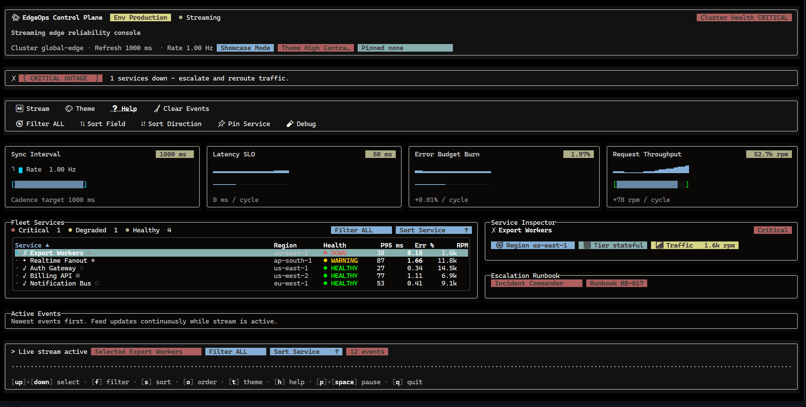

<h1 align="center">Rezi</h1>

<p align="center">
  <strong>TypeScript TUI, Near-Native Performance.</strong><br/>
  High-level developer experience powered by a deterministic C rendering engine.
</p>

<p align="center">
  <a href="https://www.npmjs.com/package/@rezi-ui/core">
    
  </a>
  <a href="https://github.com/RtlZeroMemory/Rezi/actions/workflows/ci.yml">
    
  </a>
  <a href="https://rezitui.dev/docs">
    
  </a>
  <a href="LICENSE">
    
  </a>
</p>

<p align="center">
  <a href="https://rezitui.dev">Website</a> ·
  <a href="https://rezitui.dev/docs">Docs</a> ·
  <a href="https://rezitui.dev/docs/getting-started/quickstart/">Quickstart</a> ·
  <a href="https://rezitui.dev/docs/widgets/">Widgets</a> ·
  <a href="https://rezitui.dev/docs/api/">API</a> ·
  <a href="BENCHMARKS.md">Benchmarks</a>
</p>

---

> **Status: Alpha** — under active development and changing rapidly. APIs and behavior may change between releases, and Rezi is not yet recommended for production workloads.

---

## What Rezi Can Do

Rezi is a high-performance terminal UI framework for TypeScript. You write declarative widget trees — a native C engine handles layout diffing and rendering.

- **56 built-in widgets** — layout primitives, form controls, data tables, virtual lists, navigation, overlays, a code editor, diff viewer, and more
- **Canvas drawing** — sub-character resolution via braille (2×4), sextant (2×3), quadrant (2×2), and halfblock (1×2) blitters; draw lines, shapes, and gradients within a single terminal cell grid
- **Charts & visualization** — line charts, scatter plots, heatmaps, sparklines, bar charts, gauges, and mini charts — all rendered at sub-character resolution
- **Inline image rendering** — display PNG, JPEG, and raw RGBA buffers using Kitty, Sixel, or iTerm2 graphics protocols, with automatic blitter fallback
- **Terminal auto-detection** — identifies Kitty, WezTerm, iTerm2, Ghostty, Windows Terminal, and tmux; enables the best graphics protocol automatically, with env-var overrides for any capability
- **Performance-focused architecture** — binary drawlists + native C framebuffer diffing; benchmark details and caveats are documented in the Benchmarks section
- **JSX without React** — optional `@rezi-ui/jsx` maps JSX directly to Rezi VNodes with zero React runtime overhead
- **Deterministic rendering** — same state + same events = same frames; versioned binary protocol, pinned Unicode tables
- **Hot state-preserving reload** — swap widget views or route tables in-process during development without losing app state or focus context
- **Syntax tokenizer utilities** — shared lexical highlighters for TypeScript/JS/JSON/Go/Rust/C/C++/C#/Java/Python/Bash with custom-tokenizer hooks
- **Advanced deterministic layout** — intrinsic sizing, `flexShrink`/`flexBasis`, `alignSelf`, wrapped text layout, grid spans/explicit placement, absolute positioning, and stability-signature relayout skipping
- **6 built-in themes** — dark, light, dimmed, high-contrast, nord, dracula; switch at runtime with one call
- **Declarative animation APIs** — numeric hooks (`useTransition`, `useSpring`, `useSequence`, `useStagger`) and `ui.box` transition props for position/size/opacity motion
- **Record & replay** — capture input sessions as deterministic bundles for debugging and automated testing

---

## Showcase

### EdgeOps Control Plane

A production-style terminal control console built entirely with Rezi.



### Visual Stress Test


### Image Rendering


---

## How It Works

You write declarative widget trees in TypeScript.
Rezi computes layout and emits a compact binary drawlist (ZRDL).
A native C engine — [Zireael](https://github.com/RtlZeroMemory/Zireael) — diffs framebuffers and writes only changed cells to the terminal.

Most JavaScript TUI frameworks generate ANSI escape sequences in userland on every frame. Rezi moves the hot path out of JavaScript — rendering stays ergonomic at the top and fast on real workloads.

---

## Benchmarks

Rezi is benchmarked against Ink, OpenTUI (React and Core drivers), Bubble Tea, terminal-kit, blessed, and Ratatui across 22 scenarios covering primitive workloads, terminal-level rendering, and full-app UI composition.

### How Rezi compares

**vs Ink** — Rezi is 10-200x faster across all measured scenarios. Ink uses React reconciliation + Yoga layout + ANSI string generation in JS. Rezi moves rendering to a native C engine and uses binary drawlists instead of escape-sequence strings.

**vs OpenTUI (React driver)** — Rezi is faster in all 21 scenarios (geomean ~10x). OpenTUI React uses `flushSync()` through a React reconciler on Bun.

**vs OpenTUI (Core driver)** — Rezi is faster in 19/21 scenarios (geomean ~2.6x). OpenTUI Core is a lean imperative API without React overhead. It wins on `layout-stress` (1.5x) and `tables` (1.6x), where its direct-mutation approach has lower per-frame overhead for grid-heavy layouts.

**vs Bubble Tea** — Rezi is faster in 20/21 scenarios. Bubble Tea renders via Go's string-based `View()` function with lipgloss styling. Its throughput clusters around ~120 ops/s in most scenarios due to its event-loop tick rate. Bubble Tea wins `scroll-stress` (2.5x) where Rezi's larger tree diffing cost outweighs the simpler string-append path.

**vs terminal-kit / blessed / Ratatui** — These are lower-level libraries (terminal-kit and blessed are buffer-level with no layout engine; Ratatui is native Rust). On primitive workloads that skip layout (rerender, frame-fill), they are 2-20x faster than Rezi. On structured UI workloads that require layout and widget composition (strict-ui, full-ui, virtual-list with panels), Rezi is competitive or faster. This is the expected tradeoff: Rezi provides a full widget and layout system at a cost that is measurable on micro-benchmarks but pays for itself on real applications.

### Representative numbers

| Scenario | Rezi | Ink | OpenTUI React | OpenTUI Core | Ratatui |
|---|---:|---:|---:|---:|---:|
| tree-construction (100 items) | 326us | 26ms | 36ms | 2.1ms | 696us |
| virtual-list (100K items) | 985us | 22.6ms | 28.5ms | 1.28ms | -- |
| terminal-strict-ui | 1.19ms | 25.5ms | 19.4ms | 1.77ms | 240us |
| terminal-full-ui | 2.49ms | 25.6ms | 5.07ms | 1.31ms | 336us |
| rerender | 373us | 17.7ms | 2.70ms | 1.16ms | 51us |

Numbers are from a single-replicate PTY-mode run on WSL. They are directional, not publication-grade. See [BENCHMARKS.md](BENCHMARKS.md) for full methodology, caveats, and reproduction steps.

---

## Quick Start

Get running in under a minute:

```bash
npm create rezi my-app
cd my-app
npm start
```

Or with Bun:

```bash
bun create rezi my-app
cd my-app
bun start
```

Starter templates: **dashboard**, **stress-test**, **cli-tool**, **animation-lab**, and **minimal**.

---

## Example

### `ui.*` API

```ts
import { ui } from "@rezi-ui/core";
import { createNodeApp } from "@rezi-ui/node";

const app = createNodeApp<{ count: number }>({
  initialState: { count: 0 },
});

app.view((s) =>
  ui.page({
    p: 1,
    gap: 1,
    header: ui.header({ title: "Counter", subtitle: "Beautiful defaults" }),
    body: ui.panel("Count", [
      ui.row({ gap: 1, items: "center" }, [
        ui.text(String(s.count), { variant: "heading" }),
        ui.spacer({ flex: 1 }),
        ui.button("inc", "+1", {
          intent: "primary",
          onPress: () => app.update((prev) => ({ count: prev.count + 1 })),
        }),
      ]),
    ]),
  }),
);

app.keys({ q: () => app.stop() });
await app.start();
```

## Beautiful Defaults

When the active theme provides semantic color tokens, Rezi uses design system recipes by default for:
`ui.button`, `ui.input`/`ui.textarea`, `ui.select`, `ui.checkbox`, `ui.progress`, and `ui.callout`.

- Use `intent` on buttons for common “primary/danger/link” patterns.
- Use `preset` on `ui.box` (or `ui.card`/`ui.panel`) for consistent container defaults.
- Use manual `style` props to override specific attributes (they do not disable recipes).

Docs: [Design System](docs/design-system.md) · [Migration: Beautiful Defaults](docs/migration/beautiful-defaults.md)

Install:

```bash
npm install @rezi-ui/core @rezi-ui/node
```

---

### JSX (No React Runtime)

`@rezi-ui/jsx` maps JSX directly to Rezi VNodes.

```tsx
/** @jsxImportSource @rezi-ui/jsx */
import { createNodeApp } from "@rezi-ui/node";
import { Column, Row, Spacer, Text, Button } from "@rezi-ui/jsx";

const app = createNodeApp<{ count: number }>({
  initialState: { count: 0 },
});

app.view((s) => (
  <Column p={1} gap={1}>
    <Text variant="heading">Counter</Text>
    <Row gap={1} items="center">
      <Text variant="heading">{String(s.count)}</Text>
      <Spacer flex={1} />
      <Button
        id="inc"
        label="+1"
        intent="primary"
        onPress={() => app.update((prev) => ({ count: prev.count + 1 }))}
      />
    </Row>
  </Column>
));

app.keys({ q: () => app.stop() });
await app.start();
```

```bash
npm install @rezi-ui/jsx @rezi-ui/core @rezi-ui/node
```

---

## Features

**56 built-in widgets** — primitives (box, row, column, text, grid), form inputs (input, button, checkbox, select, slider), data display (table, virtual list, tree), navigation (tabs, accordion, breadcrumb, pagination), overlays (modal, dropdown, toast, command palette), advanced (code editor with built-in/custom syntax tokenization, diff viewer, file picker, logs console), and visualization (canvas, image, line chart, scatter, heatmap, sparkline, bar chart, gauge, mini chart).

### Graphics & Visualization

| Widget | Description |
|---|---|
| `ui.canvas` | Programmable drawing surface with braille, sextant, quadrant, halfblock, or ASCII blitters |
| `ui.image` | Inline images via Kitty, Sixel, iTerm2, or blitter fallback |
| `ui.lineChart` | Multi-series line charts at sub-character resolution |
| `ui.scatter` | Scatter plots with configurable point styles |
| `ui.heatmap` | Heatmap grids with automatic color scaling |
| `ui.sparkline` | Inline sparklines (text mode or high-res canvas mode) |
| `ui.barChart` | Horizontal bar charts |
| `ui.gauge` | Progress and percentage gauges |
| `ui.miniChart` | Compact inline charts |

### Terminal Graphics Protocol Support

Rezi auto-detects your terminal emulator and enables the best available graphics protocol:

| Terminal | Graphics Protocol | Hyperlinks (OSC 8) |
|---|---|---|
| Kitty | Kitty graphics | Yes |
| WezTerm | Sixel | Yes |
| iTerm2 | iTerm2 inline images | Yes |
| Ghostty | Kitty graphics | Yes |
| Windows Terminal | — | Yes |

Canvas and chart widgets work in **any** terminal via Unicode blitters — no graphics protocol required. Image widgets fall back to blitter rendering when no protocol is available.

Override any capability with environment variables:
`REZI_TERMINAL_SUPPORTS_KITTY`, `REZI_TERMINAL_SUPPORTS_SIXEL`, `REZI_TERMINAL_SUPPORTS_ITERM2`, `REZI_TERMINAL_SUPPORTS_OSC8`

### Focus & Input
- Automatic tab navigation
- Focus traps for modals
- Global keybindings
- Vim-style and chord sequences
- Mouse support (click, scroll, drag)

### Theming
Six built-in themes:
`dark`, `light`, `dimmed`, `high-contrast`, `nord`, `dracula`

Switch at runtime:

```ts
app.setTheme("nord");
```

### Deterministic Rendering
- Same state + same events = same frames
- Versioned binary protocol
- Pinned Unicode version
- Strict update semantics

### Record & Replay
Capture input sessions as deterministic bundles for debugging and testing.

---

## Who is Rezi for?

Rezi is built for:

- Real-time dashboards
- Developer tooling
- Control planes
- Log viewers
- Terminal-first applications
- Teams who want TypeScript ergonomics without sacrificing performance

---

## Architecture

Rezi separates authoring from rendering:

```
Application Code (TypeScript)
        │
        ▼
@rezi-ui/core      Layout, widgets, protocol builders
        │ ZRDL drawlist
        ▼
@rezi-ui/node      Node.js/Bun backend
        │
        ▼
@rezi-ui/native    N-API binding
        │
        ▼
Zireael (C engine) Framebuffer diff, ANSI emission
        │
        ▼
Terminal
```

Data flows down as drawlists (ZRDL).
Input events flow up as event batches (ZREV).
Both are versioned binary formats validated at the boundary.

---

## Packages

| Package | Description |
|---|---|
| `@rezi-ui/core` | Runtime-agnostic widgets, layout, themes |
| `@rezi-ui/node` | Node.js/Bun backend |
| `@rezi-ui/native` | N-API binding to Zireael |
| `@rezi-ui/jsx` | JSX runtime (no React) |
| `@rezi-ui/testkit` | Testing utilities |
| `create-rezi` | Project scaffolding CLI |

---

## Requirements

- **Runtime**: Node.js 18+ (18.18+ recommended) or Bun 1.3+
- **Platforms**: Linux x64/arm64, macOS x64/arm64, Windows x64/arm64
- **Terminal**: 256-color or true-color support recommended
- **Graphics**: For inline images, a terminal supporting Kitty graphics, Sixel, or iTerm2 inline images. Canvas and chart widgets work in any terminal via Unicode blitters.

Prebuilt native binaries are published for all supported platforms above. The
package does not compile from source at install time; for unsupported targets,
build from a repository checkout with `npm run build:native`.

## Documentation

| Resource | Link |
|---|---|
| Website & Docs | [rezitui.dev](https://rezitui.dev) |
| Getting started | [Install](https://rezitui.dev/docs/getting-started/install/) · [Quickstart](https://rezitui.dev/docs/getting-started/quickstart/) · [JSX](https://rezitui.dev/docs/getting-started/jsx/) |
| Guides | [Concepts](https://rezitui.dev/docs/guide/concepts/) · [Layout](https://rezitui.dev/docs/guide/layout/) · [Input & Focus](https://rezitui.dev/docs/guide/input-and-focus/) · [Styling](https://rezitui.dev/docs/guide/styling/) |
| Widget catalog | [56 widgets](https://rezitui.dev/docs/widgets/) |
| API reference | [TypeDoc](https://rezitui.dev/docs/api/) |
| Architecture | [Overview](https://rezitui.dev/docs/architecture/) · [Protocol](https://rezitui.dev/docs/protocol/) |

## Contributing

```bash
git clone https://github.com/RtlZeroMemory/Rezi.git
cd Rezi
git submodule update --init --recursive
npm ci
npm run build
npm test
```

See [CONTRIBUTING.md](CONTRIBUTING.md).

---

## License

Apache-2.0
