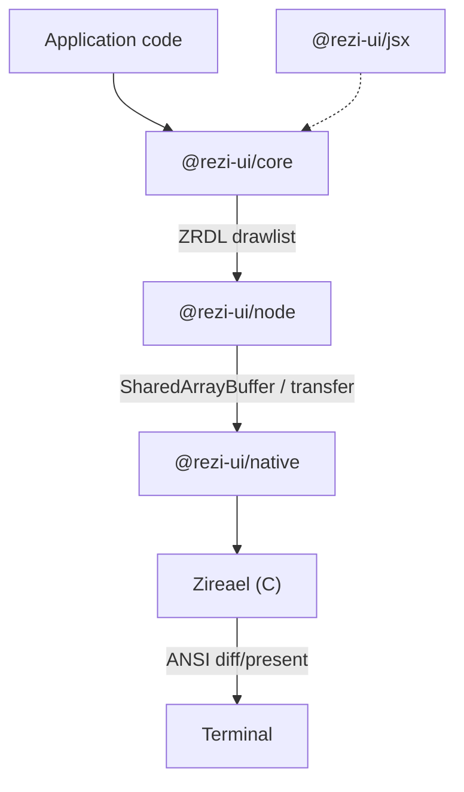

# Rezi

[](https://www.npmjs.com/package/@rezi-ui/core)
[](https://github.com/RtlZeroMemory/Rezi/actions/workflows/ci.yml)
[](https://rtlzeromemory.github.io/Rezi/)
[](LICENSE)

> **Alpha** — under active development; APIs may change between releases.

Rezi is a TypeScript terminal UI framework for Node.js and Bun, with a native rendering engine (Zireael).
You build UIs in TypeScript while Rezi emits compact drawlists and delegates terminal diff/present to native code.

In our terminal benchmark suite (`120x40`, PTY mode), Rezi is consistently in the same performance class as native TUIs: slightly slower than ratatui (Rust) by a low single-digit multiplier, while remaining substantially faster than classic JS TUI stacks in the same scenarios.


## Why Rezi exists

Most JS terminal frameworks do rendering and ANSI generation in userland for every update. This is flexible, but update cost grows quickly with larger trees and frequent rerenders.

Rezi splits responsibilities:
- App code builds a declarative widget tree.
- Rezi computes layout and emits binary drawlists.
- Zireael (native C engine) performs framebuffer diffing and terminal output.

This design keeps authoring ergonomic in TypeScript while moving hot rendering paths closer to native performance.

## How it works (high level)

1. `createApp()` runs your view function and produces VNodes.
2. Rezi commits the tree, computes layout, and builds a ZRDL drawlist.
3. `@rezi-ui/node` transports drawlists/events to `@rezi-ui/native`.
4. Zireael diffs framebuffer state and presents terminal output.

## Two ways to use it

### 1) JSX runtime (no React)

`@rezi-ui/jsx` maps JSX directly to Rezi VNodes.

```tsx
/** @jsxImportSource @rezi-ui/jsx */
import { createApp } from "@rezi-ui/core";
import { createNodeBackend } from "@rezi-ui/node";
import { Column, Row, Text, Button, Divider } from "@rezi-ui/jsx";

const app = createApp<{ count: number }>({
  backend: createNodeBackend(),
  initialState: { count: 0 },
});

app.view((s) => (
  <Column p={1} gap={1}>
    <Text style={{ bold: true }}>Counter</Text>
    <Row gap={2}>
      <Text>Count: {s.count}</Text>
      <Button id="inc" label="+1" onPress={() => app.update((st) => ({ count: st.count + 1 }))} />
    </Row>
    <Divider />
    <Text style={{ dim: true }}>Press q to quit</Text>
  </Column>
));

app.keys({ q: () => app.stop() });
await app.start();
```

```bash
npm install @rezi-ui/jsx @rezi-ui/core @rezi-ui/node
# or
bun add @rezi-ui/jsx @rezi-ui/core @rezi-ui/node
```

### 2) Native `ui.*` API

Direct VNode authoring with no React and no JSX runtime:

```ts
import { createApp, ui } from "@rezi-ui/core";
import { createNodeBackend } from "@rezi-ui/node";

const app = createApp<{ count: number }>({
  backend: createNodeBackend(),
  initialState: { count: 0 },
});

app.view((s) =>
  ui.column({ p: 1, gap: 1 }, [
    ui.text("Counter", { style: { bold: true } }),
    ui.row({ gap: 2 }, [
      ui.text(`Count: ${s.count}`),
      ui.button("inc", "+1", { onPress: () => app.update((st) => ({ count: st.count + 1 })) }),
    ]),
  ]),
);

app.keys({ q: () => app.stop() });
await app.start();
```

```bash
npm install @rezi-ui/core @rezi-ui/node
# or
bun add @rezi-ui/core @rezi-ui/node
```

## Performance overview

The main comparative dataset is `benchmarks/2026-02-11-terminal` in PTY mode, comparing:
- Rezi (TypeScript + native engine)
- ratatui (Rust)
- blessed (Node.js)
- Ink (Node.js)

Selected means:

| Scenario | ratatui (Rust) | blessed (Node) | Rezi (native engine) | Ink |
|---|---:|---:|---:|---:|
| `terminal-rerender` | 74µs | 126µs | 322µs | 16.39ms |
| `terminal-frame-fill` (`dirtyLines=1`) | 197µs | 137µs | 567µs | 17.73ms |
| `terminal-frame-fill` (`dirtyLines=40`) | 211µs | 256µs | 610µs | 17.66ms |
| `terminal-virtual-list` | 126µs | 218µs | 584µs | 18.88ms |
| `terminal-table` | 178µs | 188µs | 493µs | 17.44ms |

Interpretation:
- Rezi is generally ~2x–5x from the native Rust baseline in these microbenchmarks.
- Rezi remains far ahead of high-level JS ANSI pipelines in the same scenarios.
- This is the core goal: near-native behavior while keeping a TypeScript developer workflow.

Full methodology and caveats: [BENCHMARKS.md](BENCHMARKS.md)

## Architecture



## Feature summary

- Widget primitives: box/row/column, text, input, buttons, focus/keyboard handling
- Higher-level widgets: tables, virtual lists, code editor, diff viewer, file picker, command palette
- Protocols: ZRDL (drawlists) and ZREV (event batches)
- Backends: Node/Bun worker/inline execution modes, native addon integration

Node.js 18+ (18.18+ recommended) or Bun 1.3+ required. Prebuilt native binaries are published for Linux, macOS, and Windows (x64/arm64).

## Packages

| Package | Description |
|---|---|
| [`@rezi-ui/core`](https://www.npmjs.com/package/@rezi-ui/core) | Runtime-agnostic widgets, layout, styling, input model |
| [`@rezi-ui/node`](https://www.npmjs.com/package/@rezi-ui/node) | Node.js backend and transport (worker/inline) |
| [`@rezi-ui/native`](https://www.npmjs.com/package/@rezi-ui/native) | N-API addon binding to the native engine |
| [`@rezi-ui/jsx`](https://www.npmjs.com/package/@rezi-ui/jsx) | JSX runtime (no React reconciler) |
| [`@rezi-ui/testkit`](https://www.npmjs.com/package/@rezi-ui/testkit) | Test utilities and fixtures |
| [`create-rezi`](https://www.npmjs.com/package/create-rezi) | Scaffolding CLI |

## Quick start

```bash
npm create rezi my-app
cd my-app
npm start
```

```bash
bun create rezi my-app
cd my-app
bun start
```

Templates: `dashboard`, `form-app`, `file-browser`, `streaming-viewer`.

## Documentation

- Docs home: https://rtlzeromemory.github.io/Rezi/
- Getting started: https://rtlzeromemory.github.io/Rezi/getting-started/quickstart/
- API reference: https://rtlzeromemory.github.io/Rezi/api/reference/

## Contributing

See `CONTRIBUTING.md`.

## License

Apache-2.0. See `LICENSE`.
