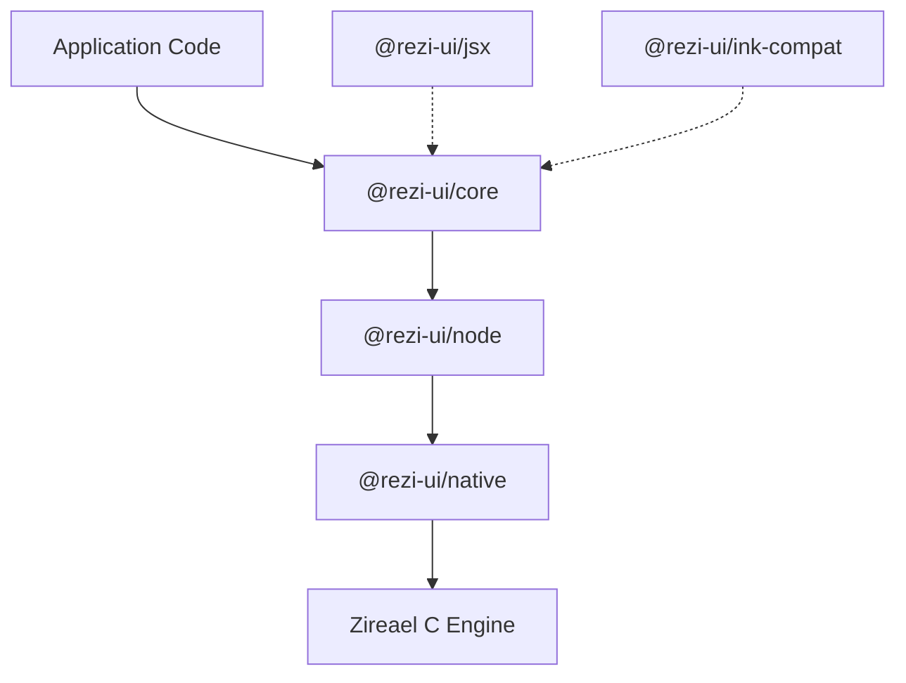

# Rezi

[](https://www.npmjs.com/package/@rezi-ui/core)
[](https://github.com/RtlZeroMemory/Rezi/actions/workflows/ci.yml)
[](https://rtlzeromemory.github.io/Rezi/)
[](LICENSE)

A terminal UI framework for Node.js that renders 1,000-item trees in 49µs. Built on the native [Zireael](https://github.com/RtlZeroMemory/Zireael) C rendering engine with binary diff protocols — no React, no Yoga, no ANSI string concatenation.

## Preview


## Performance

Rezi's native renderer bypasses the React/Yoga/ANSI pipeline entirely. The numbers speak for themselves:

### Tree construction (1000 items)

| Framework | Mean | ops/s | Peak RSS |
|---|---:|---:|---:|
| **Rezi (native)** | **49µs** | **20,321** | **120 MB** |
| Ink-on-Rezi | 12.74ms | 78 | 257 MB |
| Ink | 62.77ms | 16 | 319 MB |

**Rezi native is 1,286x faster than Ink.** Even running Ink code unchanged on Rezi's engine (Ink-on-Rezi) is 4.9x faster.

### Rerender (single state update)

| Framework | Mean | ops/s | Peak RSS |
|---|---:|---:|---:|
| **Rezi (native)** | **363ns** | **2,271,772** | **140 MB** |
| Ink-on-Rezi | 74µs | 13,434 | 140 MB |
| Ink | 16.41ms | 61 | 119 MB |

**Rezi native is 45,217x faster than Ink per rerender.** Ink-on-Rezi delivers a 221x speedup with zero code changes.

### Speedup summary

| Scenario | Ink-on-Rezi vs Ink | Rezi native vs Ink |
|---|---:|---:|
| tree-construction (10 items) | 73.8x | 4,069x |
| tree-construction (100 items) | 14.3x | 4,189x |
| tree-construction (500 items) | 5.6x | 1,462x |
| tree-construction (1000 items) | 4.9x | 1,286x |
| rerender | 221.5x | 45,217x |
| memory-profile | 74.8x | 8,947x |

<details>
<summary>Benchmark environment</summary>

Node v20.19.5 | Linux x64 | 200 iterations with warmup and forced GC between runs.

[Full methodology and all results](https://rtlzeromemory.github.io/Rezi/benchmarks/)
</details>

## Quick Start

```bash
npm create rezi my-app
cd my-app
npm start
```

Templates: `dashboard`, `form-app`, `file-browser`, `streaming-viewer`.

Or install directly:

```bash
npm install @rezi-ui/core @rezi-ui/node
```

```ts
import { createApp, ui, rgb } from "@rezi-ui/core";
import { createNodeBackend } from "@rezi-ui/node";

type State = { count: number };

const app = createApp<State>({
  backend: createNodeBackend(),
  initialState: { count: 0 },
});

app.view((state) =>
  ui.column({ p: 1, gap: 1 }, [
    ui.text("Counter", { style: { fg: rgb(120, 200, 255), bold: true } }),
    ui.button("inc", "+1", {
      onPress: () => app.update((s) => ({ count: s.count + 1 })),
    }),
    ui.text(`Count: ${state.count}`),
  ])
);

await app.start();
```

Node.js 18+ required (18.18+ recommended). Prebuilt native binaries for Linux, macOS, and Windows (x64/arm64).

## Ink Migration

Already have an Ink app? Change one import:

```diff
- import { render, Box, Text, useInput, useApp } from "ink";
+ import { render, Box, Text, useInput, useApp } from "@rezi-ui/ink-compat";
```

That's it. Your existing Ink code runs on Rezi's engine — 5x to 220x faster depending on the workload, with no other changes.

```bash
npm install @rezi-ui/ink-compat @rezi-ui/core @rezi-ui/node react
```

All Ink components (`Box`, `Text`, `Spacer`, `Newline`, `Transform`, `Static`) and hooks (`useInput`, `useApp`, `useFocus`, `useFocusManager`, `useStdin`, `useStdout`, `useStderr`) are supported.

Once running, you can gradually migrate to Rezi's native `ui.*` API for the full 1,000x+ speedup.

[Full migration guide](https://rtlzeromemory.github.io/Rezi/migration/ink/)

## Features

- **50+ widgets** — code editor, diff viewer, file picker, command palette, charts, tables, trees, overlays, forms
- **Declarative `ui.*` API** with strong TypeScript types
- **Composition API** — `defineWidget` + hooks for state and lifecycle
- **Focus management** — built-in focus ring, keybindings, chord sequences
- **6 built-in themes** with semantic color tokens and style props
- **Binary protocols** — ZRDL/ZREV for minimal IPC overhead between Node.js and the native engine
- **JSX runtime** — optional `@rezi-ui/jsx` for component-style authoring

## Architecture



## Packages

| Package | Description |
|---|---|
| [`@rezi-ui/core`](https://www.npmjs.com/package/@rezi-ui/core) | Runtime-agnostic widgets, layout, themes, forms, keybindings |
| [`@rezi-ui/node`](https://www.npmjs.com/package/@rezi-ui/node) | Node.js backend and worker model |
| [`@rezi-ui/native`](https://www.npmjs.com/package/@rezi-ui/native) | N-API addon binding to Zireael |
| [`@rezi-ui/ink-compat`](https://www.npmjs.com/package/@rezi-ui/ink-compat) | Ink compatibility layer |
| [`@rezi-ui/jsx`](https://www.npmjs.com/package/@rezi-ui/jsx) | JSX runtime |
| [`@rezi-ui/testkit`](https://www.npmjs.com/package/@rezi-ui/testkit) | Test utilities and fixtures |
| [`create-rezi`](https://www.npmjs.com/package/create-rezi) | Scaffolding CLI |

## Documentation

- [Docs home](https://rtlzeromemory.github.io/Rezi/)
- [Getting started](https://rtlzeromemory.github.io/Rezi/getting-started/quickstart/)
- [Widgets](https://rtlzeromemory.github.io/Rezi/widgets/)
- [Styling & themes](https://rtlzeromemory.github.io/Rezi/styling/)
- [Examples](https://rtlzeromemory.github.io/Rezi/getting-started/examples/)
- [API reference](https://rtlzeromemory.github.io/Rezi/api/reference/)
- [Developer guide](https://rtlzeromemory.github.io/Rezi/dev/contributing/)

## Contributing

See `CONTRIBUTING.md` for local setup and development workflows.

## License

Apache-2.0. See `LICENSE`.
