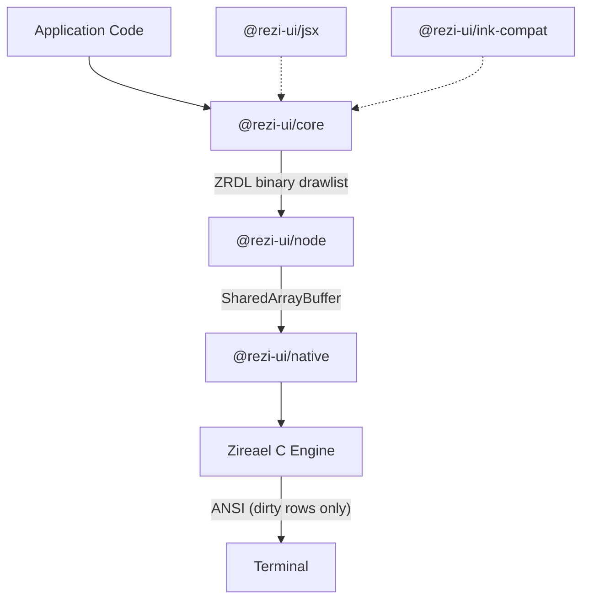

# Rezi

[](https://www.npmjs.com/package/@rezi-ui/core)
[](https://github.com/RtlZeroMemory/Rezi/actions/workflows/ci.yml)
[](https://rtlzeromemory.github.io/Rezi/)
[](LICENSE)

> **Alpha** — Rezi is under active development. APIs may change between releases. Bug reports and contributions welcome.

A terminal UI framework for Node.js built on the [Zireael](https://github.com/RtlZeroMemory/Zireael) C rendering engine.


## Why Rezi

Ink renders terminals the same way browsers rendered pages in 2005: rebuild the entire output from scratch on every frame, emit raw ANSI escape codes string-by-string, single-threaded, garbage-collected at every step.

Rezi takes a different approach. The rendering pipeline is a native C engine ([Zireael](https://github.com/RtlZeroMemory/Zireael)) that receives structured binary drawlists, diffs frames at the row level, and writes only what changed.

**What that means concretely:**

| Layer | Ink | Rezi |
|-------|-----|------|
| Layout | Yoga (WASM) | Zireael (native C) |
| Frame format | ANSI string concatenation | Binary drawlist (ZRDL) — 4-byte aligned commands, interned string pool |
| Diffing | None — full frame rewrite every render | Row-level FNV-1a hashing with collision guard. Only dirty rows emit escape codes |
| Scroll | Redraws all cells | Detects vertical shifts, emits DECSTBM + SU/SD (3 sequences instead of thousands) |
| Memory | Per-frame JS allocations, GC pressure | Arena allocator — bump pointer per frame, O(1) reset, no malloc/free churn |
| Threading | Single-threaded, blocks event loop | Worker thread via SharedArrayBuffer. Main thread returns immediately after `update()` |
| Framebuffer | None | Double-buffered. Previous frame's row hashes become next frame's baseline (zero-copy swap) |

The result:

### Tree construction (1000 items, full pipeline)

| Framework | Mean | ops/s | Peak RSS |
|---|---:|---:|---:|
| **Rezi (native)** | **1.66ms** | **603** | **188 MB** |
| Ink-on-Rezi | 12.85ms | 78 | 251 MB |
| Ink | 61.90ms | 16 | 360 MB |

### Rerender (single state change)

| Framework | Mean | ops/s | Peak RSS |
|---|---:|---:|---:|
| **Rezi (native)** | **25µs** | **38,906** | **142 MB** |
| Ink-on-Rezi | 58µs | 16,997 | 116 MB |
| Ink | 16.64ms | 60 | 119 MB |

37x faster for tree construction. 655x faster per rerender. Ink-on-Rezi (existing Ink code, zero changes) is 4.8–285x faster.

<details>
<summary>Methodology</summary>

Node v20.19.5, Linux x64. All three frameworks go through their full render pipeline: state update → tree rebuild → diff → frame output. Each uses a backend stub (BenchBackend / MeasuringStream) to isolate render cost from terminal I/O. 500 iterations (construction) / 1000 iterations (rerender) with warmup and forced GC.

[Full results and methodology](https://rtlzeromemory.github.io/Rezi/benchmarks/)
</details>

## Quick Start

```bash
npm create rezi my-app
cd my-app
npm start
```

Templates: `dashboard`, `form-app`, `file-browser`, `streaming-viewer`.

Or install directly:

```bash
npm install @rezi-ui/core @rezi-ui/node
```

```ts
import { createApp, ui, rgb } from "@rezi-ui/core";
import { createNodeBackend } from "@rezi-ui/node";

type State = { count: number };

const app = createApp<State>({
  backend: createNodeBackend(),
  initialState: { count: 0 },
});

app.view((state) =>
  ui.column({ p: 1, gap: 1 }, [
    ui.text("Counter", { style: { fg: rgb(120, 200, 255), bold: true } }),
    ui.button("inc", "+1", {
      onPress: () => app.update((s) => ({ count: s.count + 1 })),
    }),
    ui.text(`Count: ${state.count}`),
  ])
);

await app.start();
```

Node.js 18+ required (18.18+ recommended). Prebuilt native binaries for Linux, macOS, and Windows (x64/arm64).

## Ink Migration

Change one import:

```diff
- import { render, Box, Text, useInput, useApp } from "ink";
+ import { render, Box, Text, useInput, useApp } from "@rezi-ui/ink-compat";
```

Your existing Ink code runs on Rezi's engine — 5x to 285x faster depending on workload, no other changes required.

```bash
npm install @rezi-ui/ink-compat @rezi-ui/core @rezi-ui/node react
```

All Ink components (`Box`, `Text`, `Spacer`, `Newline`, `Transform`, `Static`) and hooks (`useInput`, `useApp`, `useFocus`, `useFocusManager`, `useStdin`, `useStdout`, `useStderr`) are supported. The native `ui.*` API is available for new code where the full 37–655x speedup matters.

[Migration guide](https://rtlzeromemory.github.io/Rezi/migration/ink/)

## Features

- **50+ widgets** — code editor, diff viewer, file picker, command palette, charts, tables, trees, overlays, forms
- **Declarative `ui.*` API** with strong TypeScript types
- **Composition API** — `defineWidget` + hooks for state and lifecycle
- **Focus management** — built-in focus ring, keybindings, chord sequences
- **6 built-in themes** with semantic color tokens and style props
- **Binary protocols** — ZRDL (drawlists) and ZREV (event batches) for minimal IPC overhead
- **JSX runtime** — optional `@rezi-ui/jsx` for component-style authoring

## Architecture



## Packages

| Package | Description |
|---|---|
| [`@rezi-ui/core`](https://www.npmjs.com/package/@rezi-ui/core) | Runtime-agnostic widgets, layout, themes, forms, keybindings |
| [`@rezi-ui/node`](https://www.npmjs.com/package/@rezi-ui/node) | Node.js backend and worker model |
| [`@rezi-ui/native`](https://www.npmjs.com/package/@rezi-ui/native) | N-API addon binding to Zireael |
| [`@rezi-ui/ink-compat`](https://www.npmjs.com/package/@rezi-ui/ink-compat) | Ink compatibility layer |
| [`@rezi-ui/jsx`](https://www.npmjs.com/package/@rezi-ui/jsx) | JSX runtime |
| [`@rezi-ui/testkit`](https://www.npmjs.com/package/@rezi-ui/testkit) | Test utilities and fixtures |
| [`create-rezi`](https://www.npmjs.com/package/create-rezi) | Scaffolding CLI |

## Documentation

- [Docs home](https://rtlzeromemory.github.io/Rezi/)
- [Getting started](https://rtlzeromemory.github.io/Rezi/getting-started/quickstart/)
- [Widgets](https://rtlzeromemory.github.io/Rezi/widgets/)
- [Styling & themes](https://rtlzeromemory.github.io/Rezi/styling/)
- [Examples](https://rtlzeromemory.github.io/Rezi/getting-started/examples/)
- [API reference](https://rtlzeromemory.github.io/Rezi/api/reference/)

## Contributing

See [`CONTRIBUTING.md`](CONTRIBUTING.md) for local setup and development workflows.

## License

Apache-2.0. See [`LICENSE`](LICENSE).
