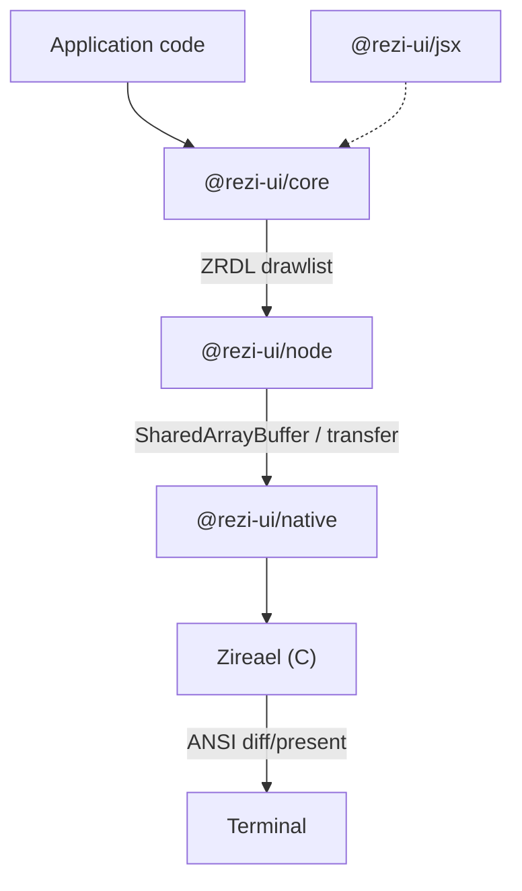

# Rezi

[](https://www.npmjs.com/package/@rezi-ui/core)
[](https://github.com/RtlZeroMemory/Rezi/actions/workflows/ci.yml)
[](https://rtlzeromemory.github.io/Rezi/)
[](LICENSE)

> **Alpha** — under active development; APIs may change between releases.

Rezi is a TypeScript/Node.js terminal UI framework with near-native rendering performance. Write your UI in TypeScript — with React, JSX, or a direct widget API — while a native C engine (Zireael) handles framebuffer diffing and terminal output.

Across benchmarked scenarios, Rezi's render pipeline is within 3–5x of ratatui (Rust) and 10–50x faster than Ink. See [BENCHMARKS.md](BENCHMARKS.md) for methodology, caveats, and full results.


## Why Rezi exists

Terminal UIs typically pay for each update by rebuilding a full ANSI frame in userland, then writing it to stdout. That approach is simple and broadly compatible, but it tends to scale poorly for repeated small state changes or large trees.

Rezi separates the concerns:

- App code builds a declarative widget tree.
- Rezi computes layout and emits a compact binary drawlist.
- A native engine consumes the drawlist and handles terminal-diff/present logic.

The result is per-frame rendering costs closer to compiled TUI frameworks than to JavaScript-side ANSI generation.

## How it works (high level)

1. `createApp()` runs your view function to produce VNodes.
2. Rezi commits the tree, runs layout, and builds a ZRDL drawlist.
3. `@rezi-ui/node` transports drawlists/events to `@rezi-ui/native`.
4. The Zireael engine diffs/presents output to the terminal.

## Two ways to use it

### 1) JSX runtime (no React)

`@rezi-ui/jsx` is a standalone JSX runtime that produces Rezi VNodes directly.

```tsx
/** @jsxImportSource @rezi-ui/jsx */
import { createApp } from "@rezi-ui/core";
import { createNodeBackend } from "@rezi-ui/node";
import { Column, Row, Text, Button, Divider } from "@rezi-ui/jsx";

const app = createApp<{ count: number }>({
  backend: createNodeBackend(),
  initialState: { count: 0 },
});

app.view((s) => (
  <Column p={1} gap={1}>
    <Text style={{ bold: true }}>Counter</Text>
    <Row gap={2}>
      <Text>Count: {s.count}</Text>
      <Button id="inc" label="+1" onPress={() => app.update((st) => ({ count: st.count + 1 }))} />
    </Row>
    <Divider />
    <Text style={{ dim: true }}>Press q to quit</Text>
  </Column>
));

app.keys({ q: () => app.stop() });
await app.start();
```

```bash
npm install @rezi-ui/jsx @rezi-ui/core @rezi-ui/node
```

### 2) Native `ui.*` API

Direct VNode authoring (no React, no JSX runtime):

```ts
import { createApp, ui } from "@rezi-ui/core";
import { createNodeBackend } from "@rezi-ui/node";

const app = createApp<{ count: number }>({
  backend: createNodeBackend(),
  initialState: { count: 0 },
});

app.view((s) =>
  ui.column({ p: 1, gap: 1 }, [
    ui.text("Counter", { style: { bold: true } }),
    ui.row({ gap: 2 }, [
      ui.text(`Count: ${s.count}`),
      ui.button("inc", "+1", { onPress: () => app.update((st) => ({ count: st.count + 1 })) }),
    ]),
  ]),
);

app.keys({ q: () => app.stop() });
await app.start();
```

```bash
npm install @rezi-ui/core @rezi-ui/node
```

## Performance overview

The benchmark suite compares Rezi (native), Ink-on-Rezi, and Ink under controlled workloads, plus a separate terminal suite that adds blessed (Node.js) and ratatui (Rust). Each run reports mean, standard deviation, and a 95% confidence interval for the mean. Full methodology and limitations are in [BENCHMARKS.md](BENCHMARKS.md).


Selected results from `benchmarks/2026-02-11-full` (`--io stub`, isolates the render pipeline from terminal I/O):

| Scenario | Rezi (native) | Ink-on-Rezi | Ink |
|---|---:|---:|---:|
| Tree construction (items=1000) | 1.47ms | 10.90ms | 50.45ms |
| Rerender (single update) | 34µs | 86µs | 16.37ms |

Selected results from `benchmarks/2026-02-11-pty` (`--io pty`, measures the PTY/TTY write path; does not include terminal emulator rendering):

| Scenario | Rezi (native) | Ink-on-Rezi | Ink |
|---|---:|---:|---:|
| Tree construction (items=1000) | 1.81ms | 11.27ms | 53.15ms |
| Rerender (single update) | 353µs | 414µs | 16.52ms |

Note: `Ink-on-Rezi` measurements above refer to the previous compatibility prototype.  
A redesigned Ink compatibility layer is currently in progress and is intentionally withheld until it passes stricter correctness and stability validation.

A separate terminal competitor suite compares Rezi against blessed (Node.js) and ratatui (Rust) on viewport-sized PTY workloads at 120×40. In these scenarios, Rezi is within 3–5x of ratatui while remaining roughly 30–50x faster than Ink (`benchmarks/2026-02-11-terminal`):

| Scenario (PTY) | ratatui | blessed | Rezi (native) | Ink |
|---|---:|---:|---:|---:|
| `terminal-rerender` | 74µs | 126µs | 322µs | 16.39ms |
| `terminal-table` | 178µs | 188µs | 493µs | 17.44ms |

Full results, methodology, and limitations: [BENCHMARKS.md](BENCHMARKS.md)

## Architecture



## Feature summary

- Widget primitives: box/row/column, text, input, buttons, focus/keyboard handling
- Higher-level widgets: tables, virtual lists, code editor, diff viewer, file picker, command palette
- Protocols: ZRDL (drawlists) and ZREV (event batches)
- Backends: Node worker/inline execution modes, native addon integration

Node.js 18+ required (18.18+ recommended). Prebuilt native binaries are published for Linux, macOS, and Windows (x64/arm64).

## Packages

| Package | Description |
|---|---|
| [`@rezi-ui/core`](https://www.npmjs.com/package/@rezi-ui/core) | Runtime-agnostic widgets, layout, styling, input model |
| [`@rezi-ui/node`](https://www.npmjs.com/package/@rezi-ui/node) | Node.js backend and transport (worker/inline) |
| [`@rezi-ui/native`](https://www.npmjs.com/package/@rezi-ui/native) | N-API addon binding to the native engine |
| [`@rezi-ui/jsx`](https://www.npmjs.com/package/@rezi-ui/jsx) | JSX runtime (no React reconciler) |
| [`@rezi-ui/testkit`](https://www.npmjs.com/package/@rezi-ui/testkit) | Test utilities and fixtures |
| [`create-rezi`](https://www.npmjs.com/package/create-rezi) | Scaffolding CLI |

Ink compatibility is being redesigned and will be published again only after it is tested and proven across complex real-world workloads.

## Quick start

```bash
npm create rezi my-app
cd my-app
npm start
```

Templates: `dashboard`, `form-app`, `file-browser`, `streaming-viewer`.

## Documentation

- Docs home: https://rtlzeromemory.github.io/Rezi/
- Getting started: https://rtlzeromemory.github.io/Rezi/getting-started/quickstart/
- API reference: https://rtlzeromemory.github.io/Rezi/api/reference/

## Contributing

See `CONTRIBUTING.md`.

## License

Apache-2.0. See `LICENSE`.
