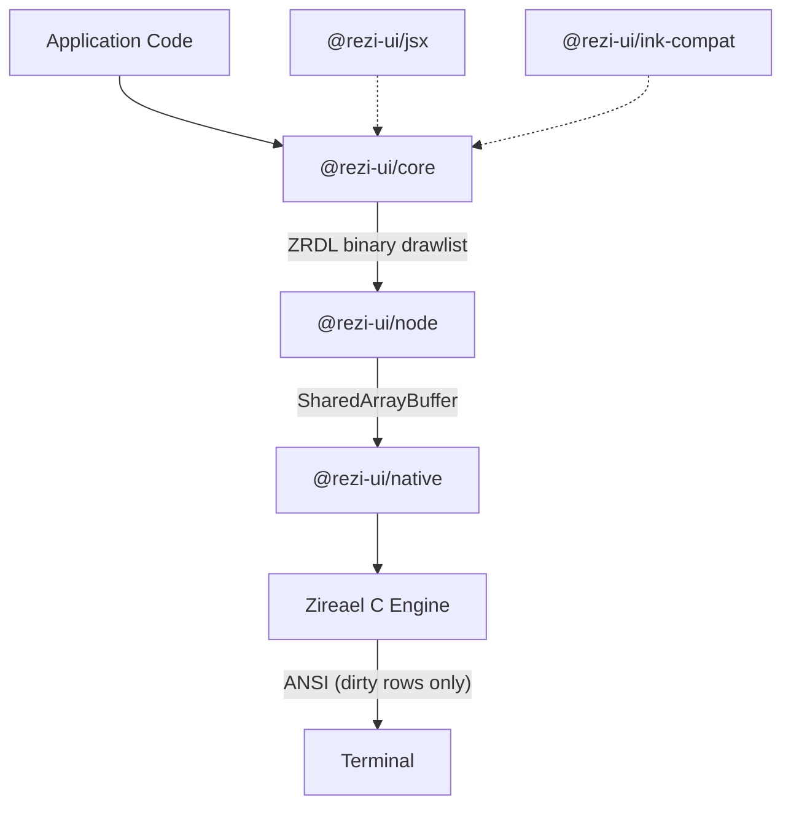

# Rezi

[](https://www.npmjs.com/package/@rezi-ui/core)
[](https://github.com/RtlZeroMemory/Rezi/actions/workflows/ci.yml)
[](https://rtlzeromemory.github.io/Rezi/)
[](LICENSE)

> **Alpha** — Rezi is under active development. APIs may change between releases. Bug reports and contributions welcome.

A terminal UI framework for Node.js built on the [Zireael](https://github.com/RtlZeroMemory/Zireael) C rendering engine.


## Three ways in

### Ink compatibility — change one import

```diff
- import { render, Box, Text, useInput, useApp } from "ink";
+ import { render, Box, Text, useInput, useApp } from "@rezi-ui/ink-compat";
```

Existing Ink code runs on Rezi's engine with no other changes. All components (`Box`, `Text`, `Spacer`, `Newline`, `Transform`, `Static`) and hooks (`useInput`, `useApp`, `useFocus`, `useFocusManager`, `useStdin`, `useStdout`, `useStderr`) are supported. [Migration guide](https://rtlzeromemory.github.io/Rezi/migration/ink/)

```bash
npm install @rezi-ui/ink-compat @rezi-ui/core @rezi-ui/node react
```

### JSX — no React required

`@rezi-ui/jsx` provides a standalone JSX runtime. Same syntax React developers know, but compiles directly to Rezi VNodes with no reconciler overhead.

```tsx
/** @jsxImportSource @rezi-ui/jsx */
import { createApp, rgb } from "@rezi-ui/core";
import { createNodeBackend } from "@rezi-ui/node";
import { Column, Text, Row, Button, Divider } from "@rezi-ui/jsx";

type State = { count: number };

const app = createApp<State>({
  backend: createNodeBackend(),
  initialState: { count: 0 },
});

app.view((state) =>
  <Column p={1} gap={1}>
    <Text style={{ fg: rgb(120, 200, 255), bold: true }}>Counter</Text>
    <Row gap={2}>
      <Text>Count: {state.count}</Text>
      <Button id="inc" label="+1" onPress={() => app.update((s) => ({ count: s.count + 1 }))} />
    </Row>
    <Divider />
    <Text style={{ dim: true }}>Press q to quit</Text>
  </Column>
);

app.keys({ q: () => app.stop() });
await app.start();
```

50+ JSX elements: `Table`, `CodeEditor`, `DiffViewer`, `FilePicker`, `CommandPalette`, `Modal`, `Tree`, `VirtualList`, `BarChart`, and more.

```bash
npm install @rezi-ui/jsx @rezi-ui/core @rezi-ui/node
```

### Native `ui.*` API — maximum performance

```ts
import { createApp, ui, rgb } from "@rezi-ui/core";
import { createNodeBackend } from "@rezi-ui/node";

const app = createApp<{ count: number }>({
  backend: createNodeBackend(),
  initialState: { count: 0 },
});

app.view((state) =>
  ui.column({ p: 1, gap: 1 }, [
    ui.text("Counter", { style: { fg: rgb(120, 200, 255), bold: true } }),
    ui.button("inc", "+1", {
      onPress: () => app.update((s) => ({ count: s.count + 1 })),
    }),
    ui.text(`Count: ${state.count}`),
  ])
);

await app.start();
```

```bash
npm install @rezi-ui/core @rezi-ui/node
```

All three APIs produce the same VNodes and go through the same rendering engine. The difference is authoring style, not runtime cost (JSX and `ui.*` are equivalent; ink-compat adds React reconciler overhead).

Node.js 18+ required (18.18+ recommended). Prebuilt native binaries for Linux, macOS, and Windows (x64/arm64).

## Why it's fast

Ink rebuilds the entire ANSI output from scratch on every state change — Yoga WASM layout, string concatenation, full frame write. Rezi sends structured binary drawlists to a native C engine that diffs frames at the row level and writes only what changed.

| Layer | Ink | Rezi |
|-------|-----|------|
| Layout | Yoga (WASM) | Zireael (native C) |
| Frame format | ANSI string concatenation | Binary drawlist (ZRDL) — 4-byte aligned commands, interned string pool |
| Diffing | String equality check on full output; any change rewrites all lines | Row-level FNV-1a hashing with collision guard. Only dirty rows emit escape codes |
| Scroll | Redraws all cells | Detects vertical shifts, emits DECSTBM + SU/SD (3 sequences instead of thousands) |
| Memory | Per-frame JS allocations, GC pressure | Arena allocator — bump pointer per frame, O(1) reset, no malloc/free churn |
| Threading | Single-threaded, blocks event loop | Worker thread via SharedArrayBuffer. Main thread returns immediately after `update()` |
| Framebuffer | Previous output cached as string for equality check | Double-buffered. Previous frame's row hashes become next frame's baseline (zero-copy swap) |

### Benchmarks

All three frameworks go through their full render pipeline end-to-end.

**Tree construction (1000 items):**

| Framework | Mean | ops/s | Peak RSS |
|---|---:|---:|---:|
| **Rezi (native)** | **1.66ms** | **603** | **188 MB** |
| Ink-on-Rezi | 12.85ms | 78 | 251 MB |
| Ink | 61.90ms | 16 | 360 MB |

**Rerender (single state change):**

| Framework | Mean | ops/s | Peak RSS |
|---|---:|---:|---:|
| **Rezi (native)** | **25µs** | **38,906** | **142 MB** |
| Ink-on-Rezi | 58µs | 16,997 | 116 MB |
| Ink | 16.64ms | 60 | 119 MB |

37x faster for tree construction. 655x faster per rerender. Ink-on-Rezi (existing Ink code, zero changes) is 4.8–285x faster.

<details>
<summary>Methodology</summary>

Node v20.19.5, Linux x64. Each framework uses a backend stub (BenchBackend / MeasuringStream) to isolate render cost from terminal I/O. 500 iterations (construction) / 1000 iterations (rerender) with warmup and forced GC.

[Full results and methodology](https://rtlzeromemory.github.io/Rezi/benchmarks/)
</details>

## Quick Start

```bash
npm create rezi my-app
cd my-app
npm start
```

Templates: `dashboard`, `form-app`, `file-browser`, `streaming-viewer`.

## Features

- **50+ widgets** — code editor, diff viewer, file picker, command palette, charts, tables, trees, overlays, forms
- **Composition API** — `defineWidget` + hooks for state and lifecycle
- **Focus management** — built-in focus ring, keybindings, chord sequences
- **6 built-in themes** with semantic color tokens and style props
- **Binary protocols** — ZRDL (drawlists) and ZREV (event batches) for minimal IPC overhead

## Architecture



## Packages

| Package | Description |
|---|---|
| [`@rezi-ui/core`](https://www.npmjs.com/package/@rezi-ui/core) | Runtime-agnostic widgets, layout, themes, forms, keybindings |
| [`@rezi-ui/node`](https://www.npmjs.com/package/@rezi-ui/node) | Node.js backend and worker model |
| [`@rezi-ui/native`](https://www.npmjs.com/package/@rezi-ui/native) | N-API addon binding to Zireael |
| [`@rezi-ui/ink-compat`](https://www.npmjs.com/package/@rezi-ui/ink-compat) | Ink compatibility layer |
| [`@rezi-ui/jsx`](https://www.npmjs.com/package/@rezi-ui/jsx) | JSX runtime (no React) |
| [`@rezi-ui/testkit`](https://www.npmjs.com/package/@rezi-ui/testkit) | Test utilities and fixtures |
| [`create-rezi`](https://www.npmjs.com/package/create-rezi) | Scaffolding CLI |

## Documentation

- [Docs home](https://rtlzeromemory.github.io/Rezi/)
- [Getting started](https://rtlzeromemory.github.io/Rezi/getting-started/quickstart/)
- [Widgets](https://rtlzeromemory.github.io/Rezi/widgets/)
- [Styling & themes](https://rtlzeromemory.github.io/Rezi/styling/)
- [Examples](https://rtlzeromemory.github.io/Rezi/getting-started/examples/)
- [API reference](https://rtlzeromemory.github.io/Rezi/api/reference/)

## Contributing

See [`CONTRIBUTING.md`](CONTRIBUTING.md) for local setup and development workflows.

## License

Apache-2.0. See [`LICENSE`](LICENSE).
