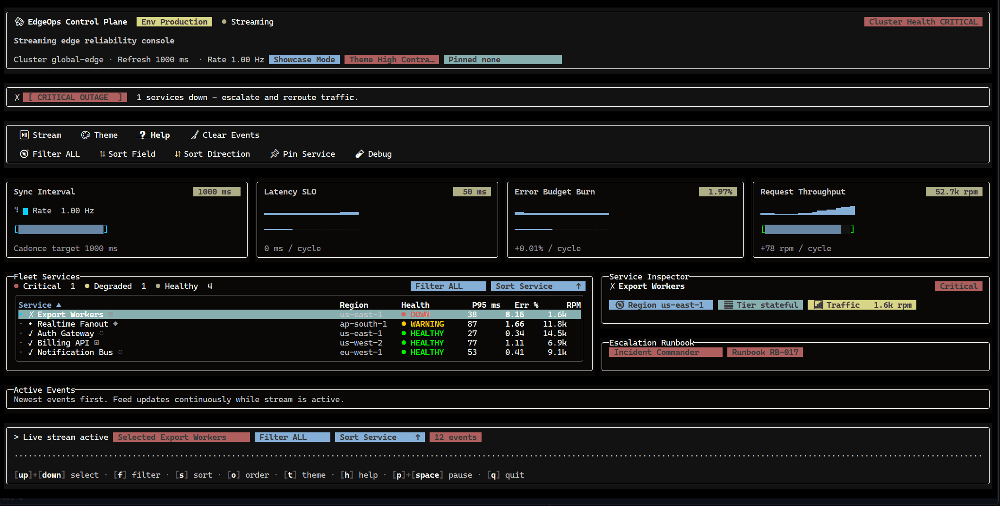

# Rezi

> **Status: pre-alpha.** Rezi is under active development. Public APIs, native ABI details, and behavior may change between releases. It is not yet recommended for production workloads.

Rezi is a TypeScript framework for deterministic, native-backed terminal applications on Node.js and Bun. It provides a declarative widget API, predictable input and rendering behavior, and a rendering pipeline powered by the [Zireael engine](https://github.com/RtlZeroMemory/Zireael) written in C.

**Links:** [Website](https://rezitui.dev/) · [Docs](https://rezitui.dev/) · [Quickstart](https://rezitui.dev/getting-started/quickstart/) · [Widgets](https://rezitui.dev/widgets/) · [Benchmarks](https://rezitui.dev/benchmarks/)



## What Rezi Is For

Rezi is aimed at terminal applications that need more than line-oriented output: multi-panel layouts, routed screens, focusable controls, forms, tables, overlays, testing support, and predictable behavior under keyboard and mouse input.

## Why Rezi

- Declarative application structure without requiring React
- Deterministic render and input contracts for testable TUI workflows
- Native-backed framebuffer diffing and terminal output through Zireael
- First-party widgets for real app surfaces: forms, tables, overlays, routing, charts, and command flows
- Behavior-first test utilities for rendering, routing, focus, and terminal scenarios

## What Rezi Includes

- Layout primitives for rows, columns, grids, panels, spacing, and layered screens
- Interactive widgets such as buttons, inputs, selects, checkboxes, radios, sliders, tabs, tables, virtual lists, trees, dialogs, dropdowns, and toasts
- Graphics and data-display widgets including canvas, charts, gauges, sparklines, heatmaps, and image support
- Application primitives for focus management, keybindings, routing, theming, and controlled state updates
- Testing utilities and deterministic rendering behavior intended to make TUI code easier to verify
- A native-backed rendering path through Zireael for layout, framebuffer diffing, and terminal output

## Example

```ts
import { ui } from "@rezi-ui/core";
import { createNodeApp } from "@rezi-ui/node";

type State = { count: number };

const app = createNodeApp<State>({ initialState: { count: 0 } });

app.view((state) =>
  ui.page({
    p: 1,
    gap: 1,
    header: ui.header({ title: "Counter" }),
    body: ui.panel("Count", [
      ui.row({ gap: 1, items: "center" }, [
        ui.text(String(state.count), { variant: "heading" }),
        ui.spacer({ flex: 1 }),
        ui.button({
          id: "inc",
          label: "+1",
          intent: "primary",
          onPress: () => app.update((s) => ({ count: s.count + 1 })),
        }),
      ]),
    ]),
  }),
);

app.keys({ q: () => app.stop() });
await app.run();
```

Install:

```bash
npm install @rezi-ui/core @rezi-ui/node
```

## Quick Start

```bash
npm create rezi my-app
cd my-app
npm run start
```

With Bun:

```bash
bun create rezi my-app
cd my-app
bun run start
```

## Public Templates

- `minimal` - small single-screen starter
- `cli-tool` - routed multi-screen workflow starter
- `starship` - polished command-console showcase with routing, charts, canvas, forms, and overlays

## Starship Demo

Use the template when you want a larger example of Rezi's app architecture:

```bash
npm create rezi my-console -- --template starship
```

The demo intentionally shows the broad surface area. For new applications, start with `minimal` or `cli-tool` unless you specifically want the full showcase.

## Feature Maturity

Rezi is still pre-alpha, but not every feature has the same risk profile. Core layout, input, routing, tables, virtual lists, command palette, and file-picker workflows are the current hardening focus. Richer surfaces such as advanced graphics, charts, code/editor-style widgets, and specialized dialogs should be treated as beta or experimental while the public API settles.

## Packages

| Package | Purpose |
|---|---|
| `@rezi-ui/core` | Widget API, layout, routing, focus, forms, themes, testing hooks |
| `@rezi-ui/node` | Node/Bun backend, terminal I/O, scheduling, native integration |
| `@rezi-ui/native` | N-API binding to the Zireael engine |
| `@rezi-ui/jsx` | Optional JSX runtime over the core API |
| `@rezi-ui/testkit` | Testing utilities |
| `create-rezi` | Project scaffolding CLI |

## Performance

Rezi is designed to stay fast on structured terminal workloads. Benchmark methodology, caveats, and committed result snapshots are documented in [BENCHMARKS.md](BENCHMARKS.md) and [docs/benchmarks.md](docs/benchmarks.md).

## Documentation

- [Install](docs/getting-started/install.md)
- [Quickstart](docs/getting-started/quickstart.md)
- [Create Rezi](docs/getting-started/create-rezi.md)
- [Widget Catalog](docs/widgets/index.md)
- [Examples](docs/getting-started/examples.md)
- [Architecture](docs/architecture/index.md)
- [Benchmarks](docs/benchmarks.md)
