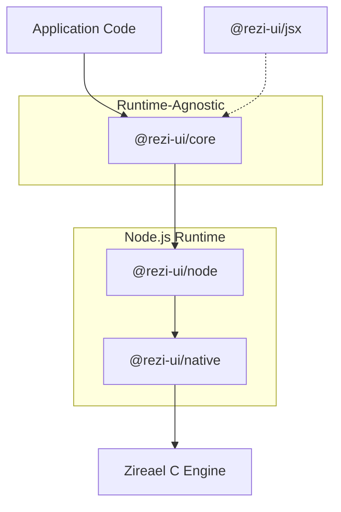

# Architecture

Rezi is a layered system: a runtime-agnostic UI core, a Node.js backend, and a native C rendering engine connected by versioned binary protocols.

## Runtime Stack



| Layer | Owns | Does NOT own |
|-------|------|-------------|
| **@rezi-ui/core** | Widget tree, layout, themes, keybindings, forms, drawlist encoding, event parsing | Terminal I/O, threads, OS APIs |
| **@rezi-ui/node** | Worker thread lifecycle, frame scheduling, buffer transport, execution mode selection | Widget logic, layout math |
| **@rezi-ui/native** | N-API binding, Zireael engine lifecycle, SharedArrayBuffer interop | Protocol semantics |
| **Zireael (C)** | Framebuffer management, diff rendering, ANSI emission, terminal capability detection, platform I/O | Widget definitions, layout, themes |

## Data Flow

A single frame follows this path:

```
1. Event Dispatch
   Terminal input → Zireael parses raw bytes → ZREV event batch →
   worker thread → main thread → app event handlers

2. State Update
   Event handler calls app.update() → state transitions queued →
   batched into single commit at next commit point

3. Render
   view(state) called → VNode tree produced → reconciliation →
   layout computed (cell coordinates) → focus resolved

4. Drawlist Encoding
   Render output → ZRDL binary drawlist (commands: clear, fill_rect,
   draw_text, push_clip, pop_clip, set_cursor)

5. Present
   Drawlist transferred to worker → worker submits to Zireael →
   Zireael diffs prev/next framebuffers → emits minimal ANSI bytes →
   single write to terminal
```

### Binary Protocol Boundary

The native engine communicates exclusively through two binary formats:

- **ZRDL** (drawlists): rendering commands flowing *down* from TypeScript to the engine. Contains a 64-byte header (`magic: "ZRDL"` / `0x4C44525A` as little-endian `u32`), followed by command records, a string table, and an optional blob table.
- **ZREV** (event batches): input events flowing *up* from the engine to TypeScript. Contains a 24-byte header (`magic: "ZREV"` / `0x5645525A` as little-endian `u32`), followed by self-framed event records (key, text, paste, mouse, resize, tick, user).

Both formats are little-endian, 4-byte aligned, and versioned. Mismatched versions produce deterministic errors at the boundary — no silent data corruption.

### Execution Modes

The Node backend supports three execution modes:

- **`"auto"`** (default): selects `"inline"` when `fpsCap <= 30`, otherwise `"worker"`.
- **`"worker"`**: native engine runs on a dedicated worker thread. Main thread is never blocked by terminal I/O.
- **`"inline"`**: engine runs on the main thread. Lower latency, but main thread blocks during I/O.

## Design Constraints

**No Node.js APIs in core.** `@rezi-ui/core` must remain runtime-agnostic. It contains no `Buffer`, `worker_threads`, `fs`, or `node:*` imports. This is enforced by CI.

**Binary boundary for safety.** All data crossing the native boundary goes through versioned binary formats with strict validation. No raw pointers or shared mutable state cross the TypeScript/C boundary.

**Deterministic rendering.** Same initial state + same event sequence = same frames. This is achieved through pinned Unicode tables (v15.1.0), versioned protocols, and strict commit-point semantics.

**No per-frame heap churn.** The engine pre-allocates framebuffers, output buffers, and event queues at creation time. The diff renderer operates on caller-provided buffers with no dynamic allocation.

**Single flush per present.** `engine_present()` writes exactly one chunk to the terminal on success, zero on failure. No partial ANSI sequences reach the terminal.

## Related Docs

- [Node backend](../backend/node.md) — backend lifecycle and `createNodeApp`
- [Worker model](../backend/worker-model.md) — thread ownership and backpressure
- [Native addon](../backend/native.md) — N-API binding details
- [Protocol overview](../protocol/index.md) — binary format specs
- [ZRDL drawlists](../protocol/zrdl.md) — rendering command format
- [ZREV event batches](../protocol/zrev.md) — input event format
- [Terminal I/O contract](../terminal-io-contract.md) — terminal interaction guarantees
