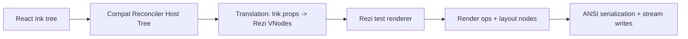

# Ink Compatibility Layer

`@rezi-ui/ink-compat` lets Ink apps run on Rezi's renderer.

It is designed for practical compatibility: keep React + Ink component/hook semantics, but replace Ink's renderer backend with Rezi's deterministic layout and draw pipeline.

## What this gives you

- Reuse existing Ink app code with minimal migration.
- Keep common Ink APIs (`render`, `Box`, `Text`, `useInput`, `useFocus`, etc.).
- Route rendering through Rezi's engine for better performance and deterministic frame behavior.
- Debug parity issues with structured traces instead of ad-hoc logging.

## Scope and expectations

Goals:

- High-fidelity behavior for real-world Ink apps.
- Stable, deterministic diagnostics for parity work.
- Clear compatibility boundaries.

Non-goals:

- Re-implement all Ink internals byte-for-byte.
- Guarantee every undocumented edge-case behavior from every Ink version/fork.

## Install and use

### Option A: explicit import swap (recommended)

Use this when you can edit source imports.

```ts
// Before
import { render, Box, Text } from "ink";

// After
import { render, Box, Text } from "@rezi-ui/ink-compat";
```

### Option B: package aliasing (no app source changes)

Use this when you want existing `import "ink"` calls to keep working.

Install alias packages under Ink names:

```bash
npm install \
  ink@npm:@rezi-ui/ink-compat@latest \
  ink-gradient@npm:ink-gradient-shim@latest \
  ink-spinner@npm:ink-spinner-shim@latest
```

Equivalent with pnpm:

```bash
pnpm add \
  ink@npm:@rezi-ui/ink-compat@latest \
  ink-gradient@npm:ink-gradient-shim@latest \
  ink-spinner@npm:ink-spinner-shim@latest
```

Equivalent with Yarn:

```bash
yarn add \
  ink@npm:@rezi-ui/ink-compat@latest \
  ink-gradient@npm:ink-gradient-shim@latest \
  ink-spinner@npm:ink-spinner-shim@latest
```

### Shims and ecosystem packages

Compat includes dedicated shims for commonly-used Ink ecosystem packages:

- `ink-gradient` -> `ink-gradient-shim`
- `ink-spinner` -> `ink-spinner-shim`

You can also import shim implementations from `@rezi-ui/ink-compat` directly:

- `@rezi-ui/ink-compat/shims/ink-gradient`
- `@rezi-ui/ink-compat/shims/ink-spinner`

## Public compatibility surface

### Components

| Export | Notes |
|---|---|
| `Box` | Ink-compatible layout/container props, including overflow/scroll props used by modern Ink forks |
| `Text` | Ink text styling props + wrapping/truncation behavior |
| `Newline` | Line break helper |
| `Spacer` | Flexible spacer helper |
| `Static` | Static channel output compatible with Ink-style scrollback behavior |
| `Transform` | Line transform wrapper (e.g. post-process text lines) |

### Hooks

| Export | Notes |
|---|---|
| `useApp` | `{ exit, rerender }` interface |
| `useInput` | Input subscription + raw mode management |
| `useFocus` | Focus registration and focus state |
| `useFocusManager` | Focus traversal/control helpers |
| `useStdin` / `useStdout` / `useStderr` | Stream access helpers |
| `useIsScreenReaderEnabled` | Reads compat screen-reader flag |
| `useCursor` | Cursor visibility/position integration |

### Runtime APIs

| Export | Notes |
|---|---|
| `render` | Primary runtime entrypoint |
| `renderToString` | Non-interactive rendering for tests/snapshots |
| `measureElement` | Layout measurement by host node ref |
| `ResizeObserver` | Compat resize observer export |
| `getBoundingBox` | Host node geometry helper |
| `getInnerHeight` / `getScrollHeight` | DOM-like helpers |

### Testing entrypoint

- `@rezi-ui/ink-compat/testing`

Provides a compact Ink-testing-library-like renderer for frame assertions and input simulation.

### Keyboard helpers

- `kittyFlags`
- `kittyModifiers`

## `render()` options

`render(element, options)` supports:

| Option | Default | Notes |
|---|---|---|
| `stdout` | `process.stdout` | Render target stream |
| `stdin` | `process.stdin` | Input source stream |
| `stderr` | `process.stderr` | Diagnostics/error output |
| `exitOnCtrlC` | `true` | Ctrl+C triggers `exit()` unless disabled |
| `patchConsole` | `true` | Patches console writes so logs do not destroy UI frame |
| `debug` | `false` | Enables verbose internal diagnostics |
| `maxFps` | `30` | Frame throttling; `<=0` disables throttling |
| `concurrent` | `false` | Kept for API compatibility; not a React scheduling mode toggle |
| `kittyKeyboard` | `{ mode: "disabled" }` | Kitty keyboard protocol support |
| `isScreenReaderEnabled` | `process.env.INK_SCREEN_READER === "true"` | Accessibility mode hint |
| `onRender` | `undefined` | Per-frame callback with `renderTime`, `output`, `staticOutput?` |
| `alternateBuffer` | `false` | Use terminal alternate screen (`?1049h`) |
| `incrementalRendering` | `false` | Incremental write mode instead of full-screen rewrite |

## How it works

### High-level pipeline



### 1. React reconciler host tree

Ink-compat provides a custom React reconciler host config that stores an `InkHostNode` tree.

- Host nodes keep type/props/children/text data.
- Focus registration and key routing are handled in bridge/context state.
- React semantics are preserved (state/effects/context/suspense in app code).

### 2. Translation layer

`translation/propsToVNode.ts` converts host nodes into Rezi VNodes.

Key mappings:

- Ink layout props -> Rezi layout props (`flex*`, spacing, min/max sizes, positioning).
- Ink border styles/colors -> Rezi border style maps.
- Ink text styling -> Rezi text style maps.
- Overflow/scroll props -> Rezi overflow and scroll props.
- Virtual nodes (`Spacer`, `Newline`, `Transform`) -> dedicated Rezi equivalents.

The translator also supports mode-based extraction:

- full tree (`translateTree`)
- dynamic subtree only (`translateDynamicTree`)
- static subtree only (`translateStaticTree`)

This is used for static channel behavior described below.

### 3. Dynamic + static channels

`<Static>` output is treated as a scrollback-oriented channel:

- Static subtree renders separately.
- Static output accumulates above dynamic frame output.
- Dynamic viewport is reduced by static row count so footers/prompts remain anchored.

This is critical for parity with Ink apps that stream logs while keeping an interactive prompt anchored.

### 4. Viewport, layout, and percent resolution

Render pass behavior:

1. Read viewport from `stdout`/fallback stream/env.
2. Translate dynamic subtree.
3. Resolve percent markers against current layout viewport.
4. Render once; if percent markers were present, render a second pass with resolved values.
5. Compute content bounds (`maxRectBottom`) from layout nodes.
6. In non-alternate-buffer mode, size ANSI grid to content height (not full terminal rows).

Additional parity behavior:

- Root viewport coercion for overflow-clipped roots.
- Resize-event timeline handling.
- Stable-output preservation on transient empty frames after resize.

### 5. ANSI output + color strategy

Color support resolution order:

1. `NO_COLOR` (non-empty) disables color.
2. `FORCE_COLOR` overrides level (0..3).
3. `stdout.getColorDepth()` if available.
4. Fallback defaults to truecolor.

When host text already contains ANSI SGR sequences, compat forces truecolor handling for that frame/path to avoid degrading pre-styled output.

### 6. Input, focus, cursor

Input flow is bridge-driven:

- Parses standard ANSI/CSI sequences.
- Optional Kitty keyboard protocol parsing.
- Emits normalized `key` object to `useInput` handlers.
- Handles Tab/Shift+Tab focus traversal.
- Handles Ctrl+C exit (unless `exitOnCtrlC: false`).

Focus flow:

- `useFocus` registers focusable IDs in bridge context.
- `useFocusManager` controls traversal and direct focus.
- Focus changes trigger rerender where needed.

Cursor flow:

- `useCursor` sets cursor position/visibility in context.
- Runtime updates terminal cursor state around frame writes.

### 7. Instance lifecycle model

`render()` behavior by `stdout`:

- One active compat instance per `stdout` stream.
- Calling `render()` again on the same `stdout` rerenders existing instance.
- `unmount()` and `cleanup()` release stream listeners, timers, raw mode, and terminal protocol state.

## Recommended integration patterns

### Pattern A: migrate imports directly

Best when you control app source and want explicitness.

- Replace `ink` imports with `@rezi-ui/ink-compat`.
- Keep app code structure unchanged first.
- Validate UI parity before broader refactors.

### Pattern B: alias package names

Best when you want a no-source-change adoption path.

- Alias `ink` to `@rezi-ui/ink-compat`.
- Alias `ink-gradient`/`ink-spinner` to shim packages.
- Run parity checks before and after dependency lockfile updates.

### Pattern C: test-first rollout

- Use `@rezi-ui/ink-compat/testing` to snapshot important frame states.
- Add keyboard/focus regression tests around core interaction loops.
- Run compatibility traces in CI for known-problem screens.

## Diagnostics and tracing

Compat diagnostics are env-gated and deterministic.

| Env var | Purpose |
|---|---|
| `INK_COMPAT_TRACE=1` | Enables compat trace stream |
| `INK_COMPAT_TRACE_FILE=/path/log` | Writes trace lines to file |
| `INK_COMPAT_TRACE_STDERR=1` | Mirrors trace lines to stderr |
| `INK_COMPAT_TRACE_DETAIL=1` | Adds node/op snapshots |
| `INK_COMPAT_TRACE_DETAIL_FULL=1` | Adds full VNode/grid snapshots + translation traces |
| `INK_COMPAT_TRACE_ALL_FRAMES=1` | Disables frame sampling |
| `INK_COMPAT_TRACE_IO=1` | Includes output/write queue diagnostics |
| `INK_COMPAT_TRACE_RESIZE_VERBOSE=1` | Includes resize timeline detail |
| `INK_COMPAT_TRACE_POLL_EVERY=<n>` | Sampling cadence |
| `INK_COMPAT_TRACE_JSON_MAX_DEPTH=<n>` | JSON trace depth limit |
| `INK_COMPAT_TRACE_JSON_ARRAY_LIMIT=<n>` | JSON array truncation limit |
| `INK_COMPAT_TRACE_JSON_OBJECT_LIMIT=<n>` | JSON object-key truncation limit |
| `INK_COMPAT_VIEWPORT_POLL_MS=<n>` | Viewport poll interval |
| `INK_COMPAT_IDLE_REPAINT_MS=<n>` | Idle repaint interval |
| `INK_GRADIENT_TRACE=1` | Gradient shim traces |

Use this runbook for full debug workflows and triage commands:

- [Ink Compat Debugging Runbook](../dev/ink-compat-debugging.md)

## Testing examples

### Render-to-string

```ts
import React from "react";
import { renderToString, Text } from "@rezi-ui/ink-compat";

const out = renderToString(<Text color="green">OK</Text>, { columns: 40 });
```

### Interactive frame assertions

```ts
import React from "react";
import { render, Text } from "@rezi-ui/ink-compat/testing";

const ui = render(<Text>Hello</Text>);
expect(ui.lastFrame()).toContain("Hello");
ui.unmount();
```

## Known compatibility boundaries

- App/version-specific message text (for example update banners) can differ without being a renderer bug.
- Slight per-character gradient interpolation differences can exist while preserving expected visual progression.
- Terminal/OS/TTY quirks can still cause minor differences outside renderer control.
- `concurrent` is accepted for API compatibility but does not map to upstream React concurrent scheduling semantics.

## Troubleshooting checklist

1. Verify package wiring first (`ink` alias/import swap + shims).
2. Reproduce with traces enabled (`INK_COMPAT_TRACE=1`).
3. Compare structure before color (`layoutViewport`, `gridViewport`, static rows, overflow counts).
4. Then inspect color/gradient data (`FORCE_COLOR`, `NO_COLOR`, `INK_GRADIENT_TRACE`).
5. Add focused regression tests for the failing screen.

## Maintainer workflow for parity fixes

1. Reproduce with trace capture.
2. Identify stage of drift: host tree vs translation vs renderer vs ANSI output.
3. Add or update tests in `packages/ink-compat/src/__tests__`.
4. Keep instrumentation environment-gated and deterministic.
5. Re-validate against upstream app screenshots/traces.
