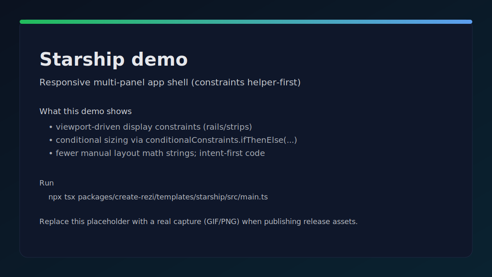
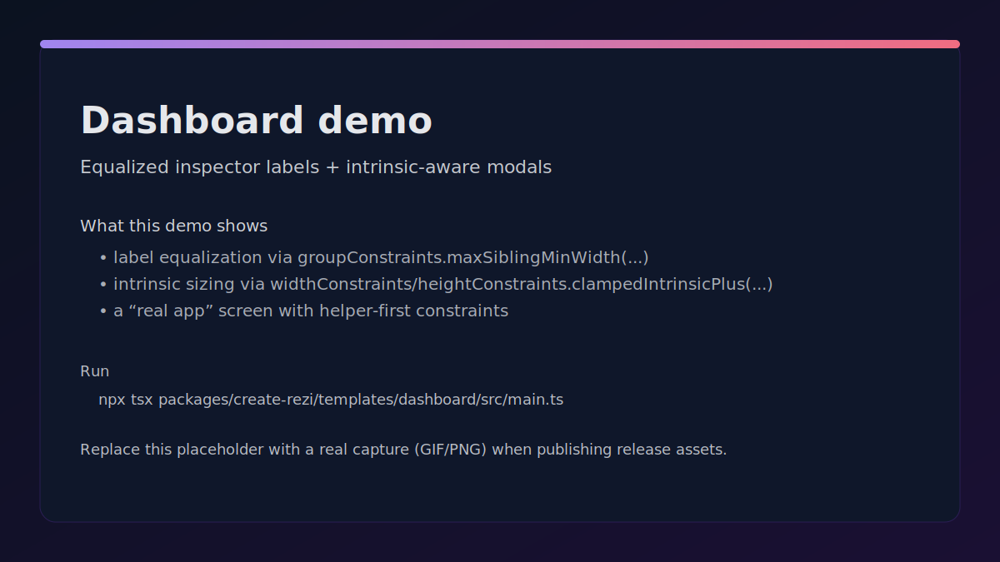
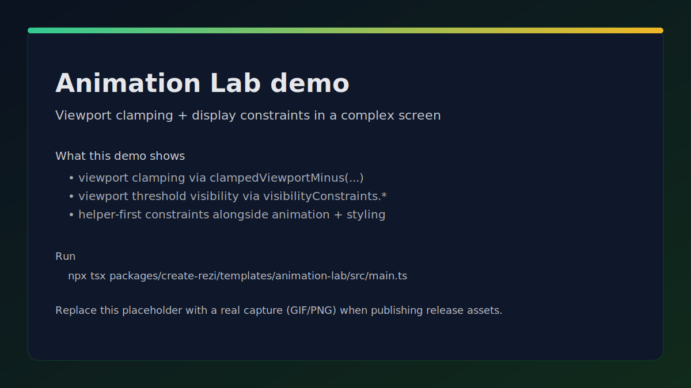

# Constraint Demos

This page lists runnable, polished demos that use the **helper-first constraint layer** in realistic layouts.

See also:
- `docs/getting-started/constraints-quickstart.md`
- `docs/reference/constraints-api.md`
- `docs/dev/live-pty-debugging.md` (frame-audit workflow)

---

## Demo 1: Starship (responsive multi-panel app shell)

- Source: `packages/create-rezi/templates/starship/src/`
- Highlights:
  - viewport-driven `display` constraints for rails/strips
  - conditional sizing via `conditionalConstraints.ifThenElse(...)`

Run:

```bash
npx tsx packages/create-rezi/templates/starship/src/main.ts
```

Keys:
- `1..6` switch routes
- `t` cycle theme
- `q` quit

Frame-audit (worker mode):

```bash
: > /tmp/rezi-frame-audit.ndjson
: > /tmp/starship.log
env -u NO_COLOR \
  REZI_STARSHIP_EXECUTION_MODE=worker \
  REZI_STARSHIP_DEBUG=1 \
  REZI_STARSHIP_DEBUG_LOG=/tmp/starship.log \
  REZI_FRAME_AUDIT=1 \
  REZI_FRAME_AUDIT_LOG=/tmp/rezi-frame-audit.ndjson \
  npx tsx packages/create-rezi/templates/starship/src/main.ts
node scripts/frame-audit-report.mjs /tmp/rezi-frame-audit.ndjson --latest-pid
```

Media:



---

## Demo 2: Dashboard (equalized inspector labels + intrinsic-aware modal)

- Source: `packages/create-rezi/templates/dashboard/src/`
- Highlights:
  - label equalization via `groupConstraints.maxSiblingMinWidth(...)`
  - intrinsic-aware modal sizing via `widthConstraints.clampedIntrinsicPlus(...)` / `heightConstraints.clampedIntrinsicPlus(...)`

Run:

```bash
npx tsx packages/create-rezi/templates/dashboard/src/main.ts
```

Media:



---

## Demo 3: Animation Lab (viewport clamping + display constraints)

- Source: `packages/create-rezi/templates/animation-lab/src/`
- Highlights:
  - viewport clamping via `widthConstraints.clampedViewportMinus(...)` / `heightConstraints.clampedViewportMinus(...)`
  - viewport threshold visibility via `visibilityConstraints.*`

Run:

```bash
npx tsx packages/create-rezi/templates/animation-lab/src/main.ts
```

Media:


