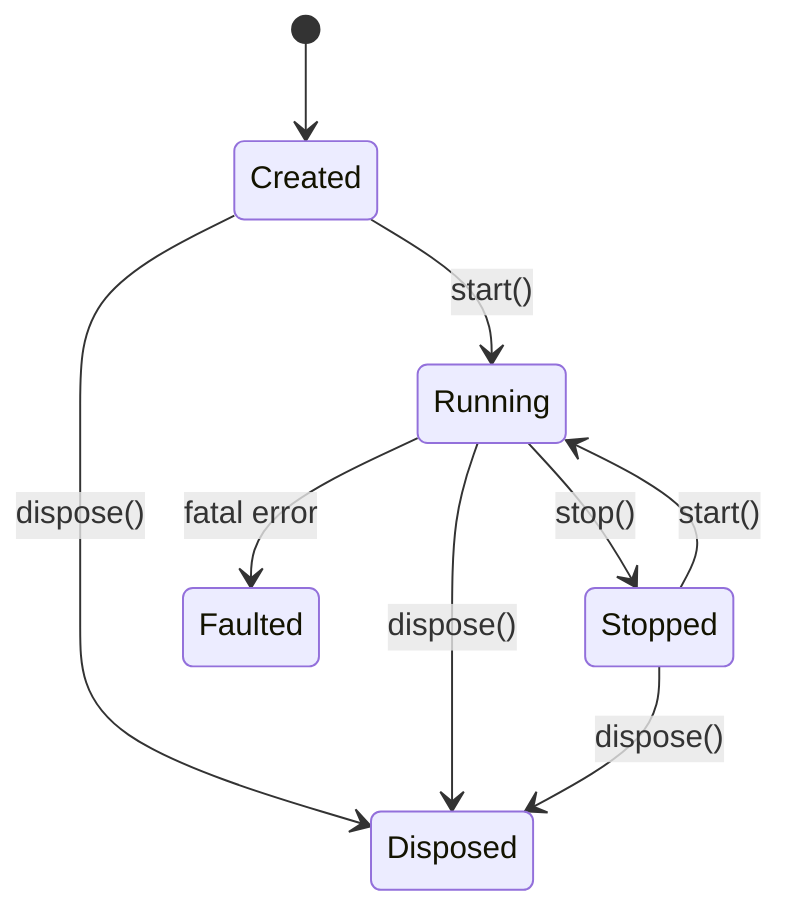

# Lifecycle & Updates

This guide explains how a Rezi app moves through its lifecycle, how updates are committed, and what “deterministic scheduling” means in practice.

## `createNodeApp` (recommended)

Apps are usually created through `createNodeApp` from `@rezi-ui/node`:

```typescript
import { ui } from "@rezi-ui/core";
import { createNodeApp } from "@rezi-ui/node";

type State = { count: number };

const app = createNodeApp<State>({
  initialState: { count: 0 },
  config: { fpsCap: 60, maxEventBytes: 1 << 20, useV2Cursor: false },
});

app.view((state) => ui.text(`Count: ${state.count}`));
await app.start();
```

`createNodeApp` keeps app/backend cursor protocol, event caps, and fps knobs in
sync by construction.

## State machine diagram



## View vs draw

Rezi supports two render modes (exactly one is active):

- **Widget mode**: `app.view((state) => VNode)` — declarative widget tree
- **Raw mode**: `app.draw((g) => void)` — low-level draw API escape hatch

Set one mode before calling `start()`. Switching modes while running is rejected deterministically.

## Update patterns

State is owned by the app. You update it via `app.update(...)`:

```typescript
// Functional update (recommended)
app.update((prev) => ({ ...prev, count: prev.count + 1 }));

// Replace state directly
app.update({ count: 0 });
```

Patterns that keep updates predictable:

- keep `view(state)` pure (no I/O, no timers, no mutations)
- do work in event handlers, then call `update(...)`
- derive display values from state inside the view

## Commit points

Updates are queued and applied at deterministic **commit points**:

1. after a backend event batch is dispatched, and
2. after an “explicit user turn” when you call `update()` outside event dispatch

That means multiple `update()` calls in one turn are applied FIFO and result in a single committed state for the next render.

## Re-entrancy

To prevent hidden feedback loops, the runtime enforces strict rules:

- calling `update()` during the render pipeline throws `ZRUI_UPDATE_DURING_RENDER`
- calling app APIs from inside an updater function throws `ZRUI_REENTRANT_CALL`

If you need to trigger a follow-up update based on a render result, schedule it from an event handler or effect (composite widget) rather than inside `view`.

## Event handling

You can handle events in three layers:

### Widget callbacks (recommended)

```typescript
ui.button({
  id: "inc",
  label: "+1",
  onPress: () => app.update((s) => ({ ...s, count: s.count + 1 })),
});
```

### Global keybindings

```typescript
app.keys({
  "q": () => app.stop(),
  "ctrl+c": () => app.stop(),
  "g g": (ctx) => ctx.update((s) => ({ ...s, count: 0 })),
});
```

### Global event stream

```typescript
const unsubscribe = app.onEvent((ev) => {
  if (ev.kind === "fatal") console.error(ev.code, ev.message);
});
// later: unsubscribe()
```

## Frame coalescing

Rezi coalesces work:

- multiple updates in a single turn produce one commit
- rendering occurs after the commit
- at most one frame is submitted in-flight at a time

This keeps runtime behavior bounded and prevents unbounded “render storms”.

## Error handling

There are two main classes of errors:

- **Synchronous misuse errors**: thrown immediately from the API call (invalid state, update during render, etc.)
- **Asynchronous fatal errors**: emitted to `onEvent` handlers as `{ kind: "fatal", ... }`, then the app transitions to `Faulted` and the backend is stopped/disposed best-effort

If you register `onEvent`, treat fatal events as terminal for that app instance.

## Runtime error codes

Deterministic violations throw `ZrUiError` with a `code`:

- `ZRUI_INVALID_STATE`: API called in the wrong app state
- `ZRUI_MODE_CONFLICT`: both `view` and `draw` configured (or conflicting mode)
- `ZRUI_NO_RENDER_MODE`: `start()` called without `view` or `draw`
- `ZRUI_REENTRANT_CALL`: runtime API called re-entrantly
- `ZRUI_UPDATE_DURING_RENDER`: `update()` called during render
- `ZRUI_DUPLICATE_KEY`: duplicate VNode `key` among siblings
- `ZRUI_DUPLICATE_ID`: duplicate widget `id` for focus routing
- `ZRUI_INVALID_PROPS`: widget props failed validation
- `ZRUI_PROTOCOL_ERROR`: backend protocol parse/validation failure
- `ZRUI_DRAWLIST_BUILD_ERROR`: drawlist build failure
- `ZRUI_BACKEND_ERROR`: backend reported a fatal error
- `ZRUI_USER_CODE_THROW`: user callback threw an exception

See the API reference for the `ZrUiErrorCode` type and related helpers.

## Cleanup

- `stop()` leaves the app in a safe stopped state; you can `start()` again
- `dispose()` releases resources and is idempotent (terminal state)
- `onEvent(...)` returns an unsubscribe function; call it when your app no longer needs the handler

## Related

- [Concepts](concepts.md) - Pure view, VNodes, and reconciliation
- [Performance](performance.md) - Why coalescing and keys matter
- [Node backend](../backend/node.md) - Runtime/backend integration details

Next: [Layout](layout.md).
