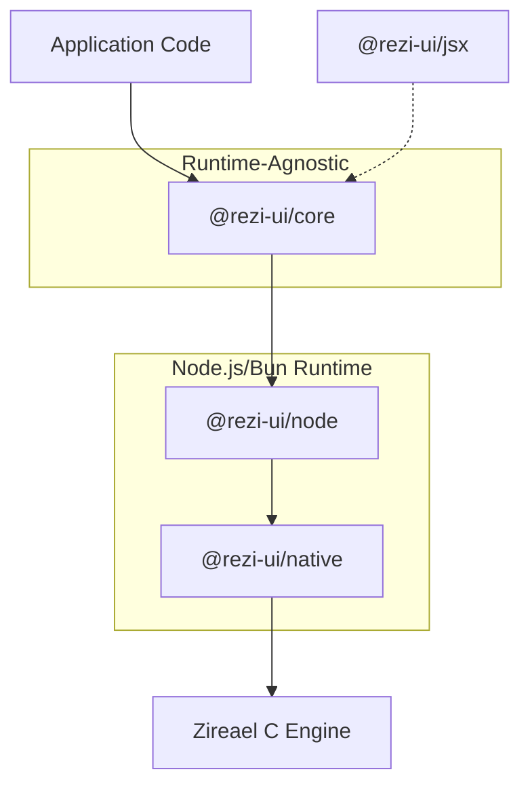

# Rezi

Rezi is a **code-first terminal UI framework** for Node.js and Bun. Build interactive terminal applications with a declarative widget API, automatic focus management, and native-backed rendering through the [Zireael](https://github.com/RtlZeroMemory/Zireael) C engine.

```typescript
import { ui, rgb } from "@rezi-ui/core";
import { createNodeApp } from "@rezi-ui/node";

const app = createNodeApp<{ count: number }>({
  initialState: { count: 0 },
});

app.view((state) =>
  ui.column({ p: 1, gap: 1 }, [
    ui.text("Counter", { style: { fg: rgb(120, 200, 255), bold: true } }),
    ui.row({ gap: 2 }, [
      ui.text(`Count: ${state.count}`),
      ui.button("inc", "+1", {
        onPress: () => app.update((s) => ({ count: s.count + 1 })),
      }),
    ]),
  ])
);

app.keys({ q: () => app.stop() });
await app.start();
```

## Why Rezi?

**Declarative and Type-Safe**
: Define your UI as a function of state. Full TypeScript support with strict typing for props, state, and events.

**Rich Widget Library**
: 54 built-in widgets covering forms, tables, trees, modals, code editors, command palettes, charts, and more.

**Native Performance**
: Powered by the Zireael C engine with a binary protocol boundary. No virtual DOM diffing overhead.

**Focus Management**
: Automatic keyboard navigation with focus zones, focus traps, and modal stacking.

**Mouse Support**
: Click to focus and activate widgets, scroll wheel for lists and editors, drag to resize split panes, click backdrops to close modals. Detected automatically — no configuration needed.

**Theming**
: Six built-in themes (dark, light, dimmed, high-contrast, nord, dracula) with semantic color tokens.

**Keybindings**
: First-class support for modal keybindings with chord sequences (Vim-style `g g`, Emacs-style `C-x C-s`).

**JSX Support**
: Write widget trees using JSX syntax with `@rezi-ui/jsx` — no React required. [Getting started →](getting-started/jsx.md)

**Performance**
: See [benchmarks →](benchmarks.md) for methodology, limitations, and the latest committed results.

## Architecture



| Layer | Purpose |
|-------|---------|
| **@rezi-ui/core** | Widgets, layout, themes, forms, keybindings. No Node.js APIs. |
| **@rezi-ui/node** | Node.js/Bun backend with worker and inline execution modes. |
| **@rezi-ui/native** | N-API addon (napi-rs) binding to the Zireael C rendering engine. |
| **@rezi-ui/jsx** | Optional JSX runtime for widget trees. |

## Getting Started

<div class="grid cards" markdown>

-   :material-download:{ .lg .middle } **Install**

    ---

    Install Rezi via npm and set up your first project.

    [:octicons-arrow-right-24: Installation](getting-started/install.md)

-   :material-clock-fast:{ .lg .middle } **Quickstart**

    ---

    Build a minimal Rezi application.

    [:octicons-arrow-right-24: Quickstart](getting-started/quickstart.md)

-   :material-widgets:{ .lg .middle } **Widgets**

    ---

    Browse the complete widget catalog.

    [:octicons-arrow-right-24: Widget Catalog](widgets/index.md)

-   :material-palette:{ .lg .middle } **Styling**

    ---

    Themes, colors, and visual customization.

    [:octicons-arrow-right-24: Styling Guide](styling/index.md)

</div>

## Core Concepts

### State-Driven Rendering

Rezi applications are state-driven. You define a `view` function that returns a widget tree based on your application state:

```typescript
type State = { items: string[]; selected: number };

app.view((state) =>
  ui.column({ gap: 1 },
    state.items.map((item, i) =>
      ui.text(i === state.selected ? `> ${item}` : `  ${item}`, {
        key: String(i),
      })
    )
  )
);
```

### State Updates

Update state with `app.update()`. Updates are batched and coalesced for efficiency:

```typescript
app.update((prev) => ({ ...prev, selected: prev.selected + 1 }));
```

### Widget Composition

Widgets compose naturally. Container widgets like `column`, `row`, and `box` accept children:

```typescript
ui.box({ title: "User Form", p: 1 }, [
  ui.field({ label: "Name", required: true, children:
    ui.input({ id: "name", value: state.name })
  }),
  ui.row({ gap: 2 }, [
    ui.button({ id: "submit", label: "Submit" }),
    ui.button({ id: "cancel", label: "Cancel" }),
  ]),
])
```

### Focus and Navigation

Interactive widgets (buttons, inputs) automatically participate in focus navigation. Use Tab/Shift+Tab to move between focusable elements, or click any focusable widget with the mouse:

```typescript
ui.column({}, [
  ui.button({ id: "first", label: "First" }),   // Tab stop 1
  ui.button({ id: "second", label: "Second" }), // Tab stop 2
  ui.input({ id: "name", value: "" }),          // Tab stop 3
])
```

## Widget Categories

### Primitives
Layout building blocks: `text`, `box`, `row`, `column`, `spacer`, `divider`

### Form Inputs
Interactive controls: `button`, `input`, `checkbox`, `radioGroup`, `select`, `field`

### Data Display
Data presentation: `table`, `virtualList`, `tree`, `richText`, `badge`, `tag`, `status`

### Overlays
Modal UIs: `modal`, `dropdown`, `layer`, `layers`, `toast`, `focusZone`, `focusTrap`

### Layout Components
Complex layouts: `splitPane`, `panelGroup`, `resizablePanel`

### Advanced Widgets
Rich functionality: `commandPalette`, `codeEditor`, `diffViewer`, `logsConsole`, `filePicker`

### Charts
Data visualization: `gauge`, `progress`, `sparkline`, `barChart`, `miniChart`

### Feedback
User feedback: `spinner`, `skeleton`, `callout`, `errorDisplay`, `empty`

## Learn More

- [Concepts](guide/concepts.md) - Understanding Rezi's architecture
- [Ink to Rezi Migration](migration/ink-to-rezi.md) - Mental model mapping and migration recipes
- [Lifecycle & Updates](guide/lifecycle-and-updates.md) - State management patterns
- [Routing](guide/routing.md) - Page-level navigation and screen history
- [Layout](guide/layout.md) - Spacing, alignment, and constraints
- [Input & Focus](guide/input-and-focus.md) - Keyboard navigation and focus management
- [Mouse Support](guide/mouse-support.md) - Click, scroll, and drag interactions
- [Styling](guide/styling.md) - Colors, themes, and visual customization
- [Performance](guide/performance.md) - Optimization techniques
- [Debugging](guide/debugging.md) - Debug tools and frame inspection
- [Architecture](architecture/index.md) - Runtime stack and data flow
- [API Reference](api.md) - TypeDoc-generated API docs
- [Developer Guide](dev/contributing.md) - Local setup and workflows
