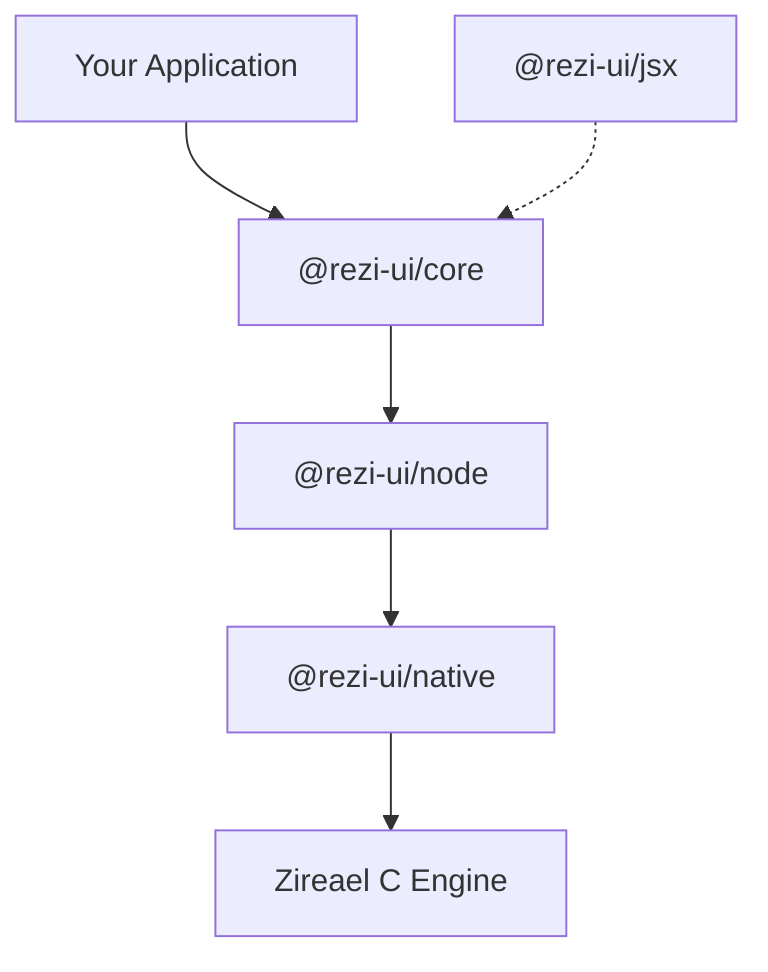

# Packages

Rezi is organized as a monorepo with focused packages and clear runtime boundaries.

## Installation

Most applications need only two packages:

```bash
npm install @rezi-ui/core @rezi-ui/node
# or
bun add @rezi-ui/core @rezi-ui/node
```

## Package Overview



| Package | Description | npm |
|---------|-------------|-----|
| [@rezi-ui/core](core.md) | Widgets, layout, themes, forms, keybindings | `npm i @rezi-ui/core` |
| [@rezi-ui/node](node.md) | Node.js/Bun backend with worker/inline execution modes | `npm i @rezi-ui/node` |
| [@rezi-ui/native](native.md) | Native addon (napi-rs + Zireael) | Bundled with node |
| [@rezi-ui/jsx](jsx.md) | JSX runtime for Rezi widgets | `npm i @rezi-ui/jsx` |
| [@rezi-ui/testkit](testkit.md) | Testing utilities and fixtures | `npm i -D @rezi-ui/testkit` |
| [create-rezi](create-rezi.md) | Project scaffolding CLI | `npm create rezi` |

## @rezi-ui/core

**Runtime-agnostic TypeScript core**

The core package defines Rezi's runtime-agnostic API and contains:

- All widget constructors (`ui.text`, `ui.button`, `ui.table`, etc.)
- Layout engine with flexbox-like semantics
- Theme system with six built-in presets
- Declarative animation hooks and `ui.box` transition props
- Form management and validation
- Keybinding parser with chord support
- Focus management utilities
- Binary protocol builders and parsers

This package has **no Node.js-specific dependencies**. Runtime adapters can reuse it by implementing the backend contract.

```typescript
import { ui, rgb, darkTheme } from "@rezi-ui/core";
```

[Full documentation →](core.md)

## @rezi-ui/node

**Node.js/Bun runtime backend**

The `@rezi-ui/node` backend provides runtime integration:

- Execution modes: `worker`, `inline`, and `auto`
- Worker-mode transport and scheduling
- Event loop integration
- Terminal capability detection
- Debug tracing and performance instrumentation

```typescript
import { createNodeApp } from "@rezi-ui/node";

const app = createNodeApp({
    initialState: {},
});
```

[Full documentation →](node.md)

## @rezi-ui/native

**Native addon (N-API + Zireael)**

The native package contains the napi-rs binding to the Zireael C rendering engine:

- Terminal I/O with platform-specific optimizations
- Binary protocol handling
- Prebuilt binaries for Linux, macOS, and Windows

This package is automatically installed as a dependency of `@rezi-ui/node`.

[Full documentation →](native.md)

## @rezi-ui/testkit

**Testing utilities**

Helper package for testing Rezi applications:

- Mock backends for unit testing
- Test fixtures for protocol testing
- Golden file comparison utilities
- Text snapshot assertions for rendered frames

```bash
npm install --save-dev @rezi-ui/testkit
# or
bun add -d @rezi-ui/testkit
```

[Full documentation →](testkit.md)

## create-rezi

**Project scaffolding CLI**

Generate a ready-to-run Rezi app with TypeScript configured and polished starter templates (`dashboard`, `stress-test`, `cli-tool`, `animation-lab`, `minimal`, `starship`):

```bash
npm create rezi my-app
# or
bun create rezi my-app
```

[Full documentation →](create-rezi.md)

## @rezi-ui/jsx

**JSX runtime**

Native JSX runtime that maps JSX elements directly to Rezi VNodes (no React required):

```bash
npm install @rezi-ui/jsx
# or
bun add @rezi-ui/jsx
```

[Full documentation →](jsx.md) | [Getting started →](../getting-started/jsx.md)

## Dependency Flow

The package dependency structure enforces a clean separation of concerns:

```
Application Code (ui.* API or JSX)
       │
       ├─── @rezi-ui/jsx (optional JSX runtime)
       │
       ▼
@rezi-ui/core (No Node APIs)
       │
       │ used by
       ▼
@rezi-ui/node (worker/inline execution, event loop)
       │
       │ binds to
       ▼
@rezi-ui/native (C engine via N-API)
       │
       ▼
Zireael C Engine (Terminal rendering)
```

## Versioning

All publishable packages share a single version number. This simplifies dependency management and ensures compatibility between packages.

Current versions can be checked in each package's `package.json` or via npm:

```bash
npm info @rezi-ui/core version
npm info @rezi-ui/node version
```

## Development Packages

The following packages are used for development only and are not published:

| Package | Purpose |
|---------|---------|
| `@rezi-ui/bench` | Performance benchmarks |
