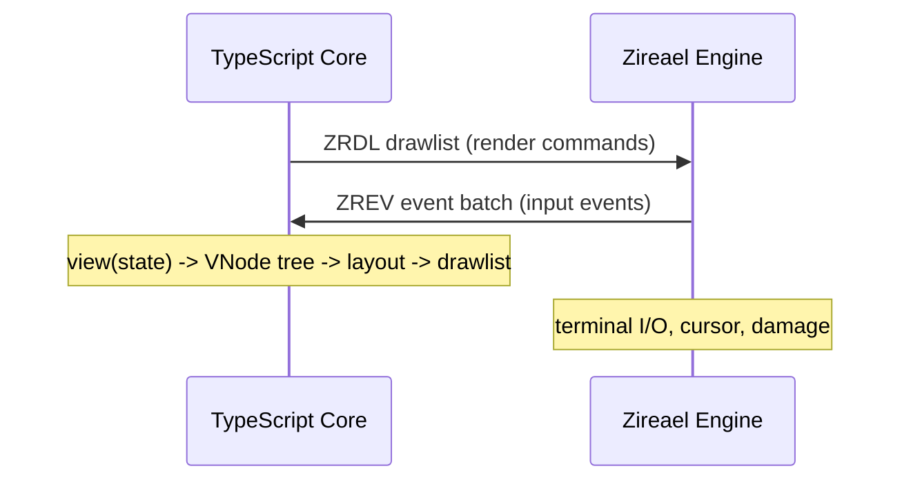

# Protocol

Rezi communicates between its TypeScript core and the Zireael C engine through two binary formats: **ZRDL** (drawlists) and **ZREV** (event batches). Both formats cross a strict ABI boundary -- the core builds drawlists and the engine consumes them; the engine produces event batches and the core parses them.

## Data flow

The core's rendering pipeline produces a ZRDL binary every frame. The engine parses that binary, executes the draw commands against the terminal, and sends back input events as ZREV batches.

## Binary format principles

All Rezi binary formats share the following properties:

- **Little-endian byte order.** All multi-byte integers are stored least-significant byte first.
- **4-byte alignment.** All section offsets, section sizes, and the total buffer size are 4-byte aligned. Padding bytes are explicitly zeroed.
- **Versioned.** Each format begins with a magic number and version field. The engine rejects unknown versions.
- **Validated strictly.** Both the builder (TypeScript side) and the engine (C side) validate the buffer independently. Malformed input is never silently accepted.

## Format summary

| Format | Magic bytes | Description | Direction |
|--------|-------------|-------------|-----------|
| ZRDL | `0x4C44525A` (`ZRDL`) | Drawlist: rendering commands, strings, blobs | Core -> Engine |
| ZREV | `0x5645525A` (`ZREV`) | Event batch: keyboard/mouse/resize events | Engine -> Core |

Both magic values are encoded as little-endian `u32` constants.

## Sub-pages

| Page | Topic |
|------|-------|
| [Drawlists (ZRDL)](zrdl.md) | Header layout, command opcodes, string/blob tables, style encoding |
| [Cursor](cursor.md) | SET_CURSOR command and cursor state management |
| [Versioning](versioning.md) | ABI version pins, drawlist/event versions, Unicode pin, compatibility |
| [Safety rules](safety.md) | Validation patterns, cap enforcement, error types, sticky errors |
| [Event batches (ZREV)](zrev.md) | Event batch format and parsing |
| [ABI pins](abi.md) | Exported constants and version numbers |
